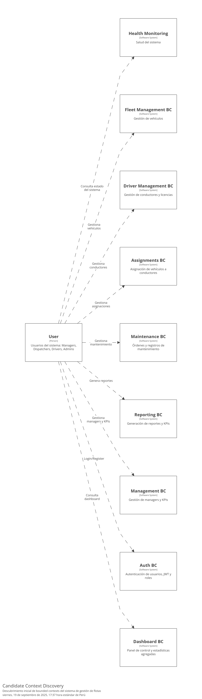
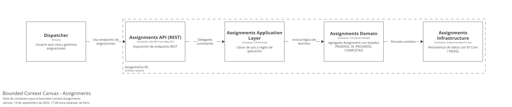
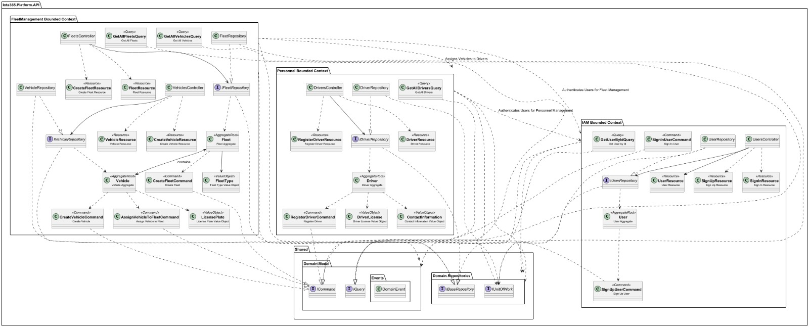
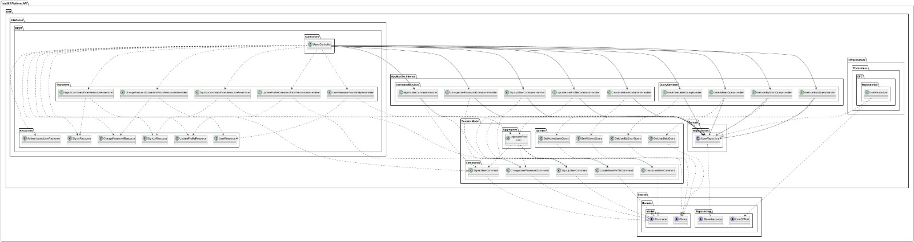
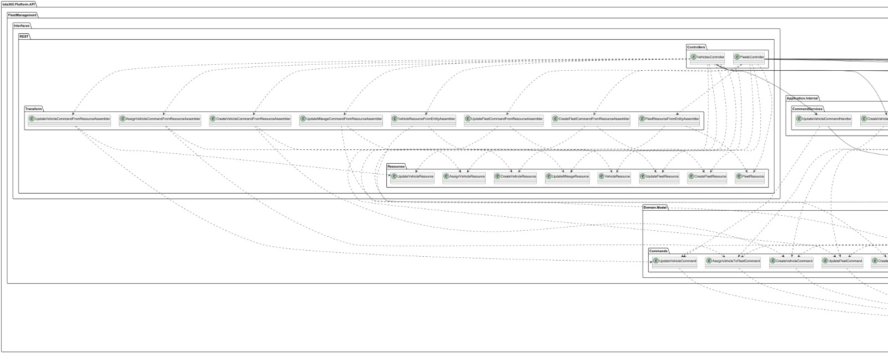
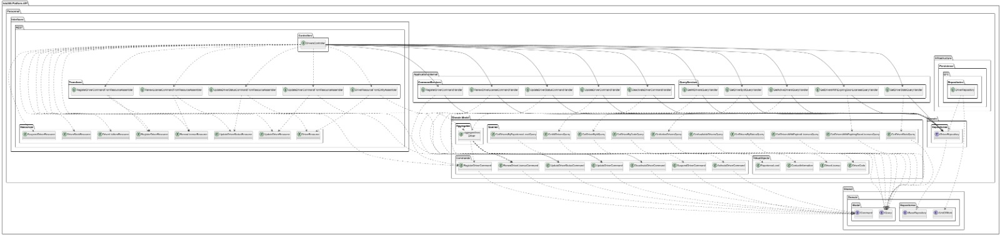
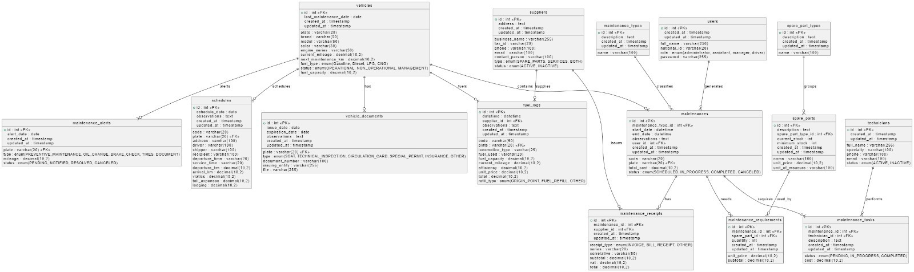

# Capítulo 2: Requirements Development and Software Solution Design

## 2.1. Competidores

En esta sección se presenta la identificación y descripción de los principales competidores de Flota365, tanto directos como indirectos. Estos actores del mercado cuentan con propuestas basadas en productos digitales similares o con enfoques que abordan parcialmente el mismo problema que nuestra solución. La comparación busca evidenciar las características esenciales de cada alternativa y contextualizar el entorno competitivo en el que se desarrollará Flota365.

Se han identificado los siguientes competidores directos de Flota 365, todos con presencia en el mercado latinoamericano y con soluciones digitales para la gestión de flotas:

**- RDA Mobility**

Empresa con presencia en Argentina, Colombia y Uruguay, que ofrece soluciones de renting corporativo, gestión de flotas y telemetría vehicular.

**- Geotab**

Multinacional canadiense especializada en soluciones de telemática y software de gestión de flotas, con presencia en América Latina.

**- iLab Perú**

Empresa peruana que ofrece un sistema web de gestión de flotas, con funcionalidades orientadas al monitoreo y control de vehículos.

### 2.1.1. Análisis competitivo
El análisis competitivo tiene como finalidad profundizar en el conocimiento que tiene Flota365 sobre el resto de sus competidores. Para ello, se ha elaborado un *Competitive Analysis Landscape*, el cual organiza de manera estructurada los aspectos clave de cada actor analizado, incluyendo perfil general, estrategia de marketing, características del producto, precios y canales de distribución. Finalmente, se incorpora un análisis FODA que permite visualizar de forma clara las fortalezas, debilidades, oportunidades y amenazas, tanto propias como de los competidores. 
 
 

<table border="1" cellpadding="8" cellspacing="0" style="border-collapse:collapse; width:100%; font-family:Arial, sans-serif;">
    <tr>
        <th colspan="7">Competitive Analysis Landscape</th>
    </tr>
    <tr>
        <td colspan="2" rowspan="2"><strong>¿Por qué llevar a cabo este análisis?</strong></td>
        <td colspan="5">¿Cómo se posiciona Flota 365 frente a sus competidores en cuanto a propuesta de valor, marketing, producto y estrategia?</td>
    </tr>
    <tr>
        <td colspan="5">
            Es un análisis comparativo que permite identificar fortalezas, debilidades, oportunidades y amenazas, así como entender mejor la posición del producto frente a otros actores relevantes del mercado.
        </td>
    </tr>
    <tr>
        <td colspan="3"></td>
        <td style="text-align:center;">
            <strong>Flota 365</strong> 
            
        </td>
        <td style="text-align:center;">
            <strong>RDA Mobility</strong> 
            
        </td>
        <td style="text-align:center;">
            <strong>Geotab</strong> 
            
        </td>
        <td style="text-align:center;">
            <strong>iLab Perú</strong> 
            
        </td>
    </tr>
    <tr>
        <td rowspan="2">Perfil</td>
        <td colspan="2">Overview</td>
        <td>Plataforma de gestión de flotas orientada a pymes del Perú, con interfaz moderna, fácil de usar, y soporte técnico local.</td>
        <td>Ofrece renting vehicular corporativo, acompañado de soluciones tecnológicas para gestión de flotas.</td>
        <td>Multinacional con soluciones avanzadas de telemetría y big data para flotas.</td>
        <td>Plataforma local con enfoque básico en control y seguimiento vehicular.</td>
    </tr>
    <tr>
        <td colspan="2">Ventaja competitiva ¿Qué valor ofrece a los clientes?</td>
        <td>Simplicidad + Personalización + Costo accesible + Soporte local.</td>
        <td>Integración con renting y oferta de movilidad.</td>
        <td>Tecnología robusta, alta precisión y escalabilidad.</td>
        <td>Precio bajo y atención directa al cliente local.</td>
    </tr>
    <tr>
        <td rowspan="2">Perfil de Marketing</td>
        <td colspan="2">Mercado objetivo</td>
        <td>PYMEs de transporte, distribución y logística en Perú y LATAM.</td>
        <td>Empresas grandes y medianas con flotas corporativas.</td>
        <td>Grandes flotas, operadores logísticos y gobiernos.</td>
        <td>Pequeñas empresas con bajo presupuesto.</td>
    </tr>
    <tr>
        <td colspan="2">Estrategias de marketing</td>
        <td>Marketing digital, redes sociales, ferias del sector, alianzas con operadores.</td>
        <td>Estrategias B2B con foco en acuerdos corporativos.</td>
        <td>Alianzas internacionales y promoción en eventos tech.</td>
        <td>Venta directa, recomendaciones boca a boca.</td>
    </tr>
    <tr>
        <td rowspan="3">Perfil de Producto</td>
        <td colspan="2">Productos & Servicios</td>
        <td>Software de gestión de flotas (web/móvil), alertas, reportes, mantenimiento, rastreo.</td>
        <td>Renting + software básico de gestión.</td>
        <td>Gestión de flotas con inteligencia artificial, reportes avanzados, APIs.</td>
        <td>Plataforma de rastreo y control simple.</td>
    </tr>
    <tr>
        <td colspan="2">Precios & Costos</td>
        <td>Planes mensuales escalables según funcionalidades.</td>
        <td>Costos integrados al renting vehicular.</td>
        <td>Alto costo de entrada y por dispositivos.</td>
        <td>Muy bajo costo.</td>
    </tr>
    <tr>
        <td colspan="2">Canales de distribución (Web y/o Móvil)</td>
        <td>Web y App móvil, venta directa y distribuidores locales.</td>
        <td>Venta corporativa (B2B) con equipo comercial.</td>
        <td>Venta en línea y red global de distribuidores.</td>
        <td>Sitio web básico y atención personalizada.</td>
    </tr>
    <tr>
        <td rowspan="5">Análisis SWOT</td>
    <tr>
        <td colspan="2">Fortalezas</td>
        <td>Facilidad de uso, atención local, buen soporte, precios competitivos.</td>
        <td>Modelo integrado (renting + software), movilidad sostenible.</td>
        <td>Tecnología de punta, experiencia internacional.</td>
        <td>Costos bajos, cercanía con el cliente.</td>
    </tr>
    <tr>
        <td colspan="2">Debilidades</td>
        <td>Menor reconocimiento de marca, falta de presencia internacional.</td>
        <td>Dependencia del renting como modelo de entrada.</td>
        <td>Requiere conocimientos técnicos y gran inversión.</td>
        <td>Tecnología limitada, poca innovación.</td>
    </tr>
    <tr>
        <td colspan="2">Oportunidades</td>
        <td>Digitalización del transporte en LATAM, alianzas estratégicas.</td>
        <td>Aumento de flotas corporativas sostenibles.</td>
        <td>Expansión a nuevos mercados LATAM.</td>
        <td>Demanda de soluciones económicas en provincias.</td>
    </tr>
    <tr>
        <td colspan="2">Amenazas</td>
        <td>Ingreso de competidores internacionales, barreras regulatorias.</td>
        <td>Nuevos modelos de propiedad compartida.</td>
        <td>Startups locales con soluciones más adaptadas.</td>
        <td>Baja escalabilidad frente a otras plataformas.</td>
    </tr>
</table>

### 2.1.2. Estrategias y tácticas frente a competidores
Tras un análisis detallado de los principales competidores de Flota365 —AFE Logistics, RDA Mobility, Geotab e iLab Perú— se han identificado oportunidades estratégicas clave para fortalecer nuestra propuesta de valor, diferenciarnos y consolidar nuestra posición en el mercado. Las siguientes estrategias se fundamentan en las fortalezas, debilidades y amenazas encontradas, con tácticas específicas orientadas a maximizar la eficiencia y satisfacción del cliente.

**1) Estrategias basadas en fortalezas**

**- Enfoque especializado en el sector agrícola y de transporte rural**

**Estrategia:** Diferenciar a Flota365 como una plataforma desarrollada especialmente para la gestión de flotas en el sector agrícola, a diferencia de competidores más generalistas como Geotab o AFE Logistics.

**Táctica:**

Comunicar de forma clara nuestro enfoque en soluciones adaptadas al campo y a las condiciones rurales: vehículos agrícolas, motocicletas, camionetas de campo, etc.

Crear contenido segmentado por tipo de cliente (cooperativas agrarias, productores independientes, etc.) que demuestre cómo Flota365 se adapta a sus necesidades reales.

Participar en ferias y eventos del sector agroindustrial para reforzar la identidad de marca especializada.

 

**- Ventaja competitiva por simplicidad y personalización**

**Estrategia:** Resaltar la facilidad de uso de Flota365 frente a soluciones robustas pero más complejas como Geotab o RDA Mobility.

**Táctica:**

Desarrollar una experiencia de usuario (UX) simple e intuitiva que permita la adopción rápida por parte de conductores y personal no técnico.

Ofrecer configuraciones personalizadas y planes modulares según el tamaño y necesidades de la empresa.

Brindar soporte técnico y capacitación remota como parte del onboarding, para facilitar el uso desde el primer día.

 

**- Generación de alertas inteligentes y mantenimiento preventivo**

**Estrategia:** Capitalizar la funcionalidad de alertas automáticas por mantenimiento y uso del vehículo, la cual no está priorizada en soluciones como iLab Perú.

**Táctica:**

Mostrar casos de éxito donde el mantenimiento preventivo ha evitado fallas y costos adicionales.

Generar reportes automatizados que alerten sobre mantenimientos próximos y condiciones críticas de la unidad.

Integrar dashboards con indicadores clave de salud vehicular, rutas y uso.

 

**2) Estrategias basadas en debilidades**

**- Fortalecimiento de la cobertura de datos y actualización**

**Estrategia:** Superar la posible debilidad en la actualización de datos e información en tiempo real al integrar mejores fuentes y automatización.

**Táctica:**

Integrar sensores IoT, GPS y otros dispositivos de rastreo con compatibilidad directa con Flota365.

Implementar procesos automáticos de sincronización de datos para eliminar el error humano.

Ofrecer herramientas que permitan a los usuarios reportar incidencias o inconsistencias fácilmente.

 

**- Ampliación de funcionalidades para transporte urbano e híbrido**

**Estrategia:** Reducir la limitación actual del enfoque agrícola expandiendo Flota365 a flotas urbanas, logísticas y mixtas.

**Táctica:**

Iniciar un piloto con empresas de transporte urbano o de última milla que también manejen vehículos ligeros.

Incorporar nuevas funciones como optimización de rutas en zonas urbanas, integración con apps de reparto, y reportes de consumo por trayecto.

Desarrollar una versión adaptable del sistema para flotas mixtas que combinen lo rural y lo urbano.

 

**- Competencia con soluciones de alto presupuesto (Geotab, AFE Logistics)**

**Estrategia:** Enfocar la estrategia comercial de Flota365 como una alternativa accesible y eficiente frente a plataformas de alto costo.

**Táctica:**

Resaltar la relación costo-beneficio de Flota365 frente a sistemas de gran escala que suelen tener costos elevados de implementación.

Ofrecer modelos de suscripción flexibles y precios competitivos por unidad o por usuario.

Aplicar campañas publicitarias dirigidas a empresas medianas que requieren soluciones funcionales sin sobredimensionar el gasto.

 

**- Diferenciación frente a soluciones más tecnológicas pero menos personalizadas**

**Estrategia:** Aprovechar la cercanía con el cliente como ventaja frente a competidores como RDA Mobility o iLab Perú, que tienden a soluciones más automatizadas pero poco adaptables.

**Táctica:**

Ofrecer soporte humano en todo momento (asesoría técnica y de negocio) como parte del servicio.

Diseñar funcionalidades a medida según el giro del cliente (agrícola, carga ligera, escolar, etc.).

Mantener comunicación constante con los usuarios para evolucionar el producto según sus comentarios.

 

**3) Estrategias basadas en oportunidades**

**- Crecimiento del mercado de gestión de flotas en zonas rurales e interprovinciales**

**Estrategia:** Aprovechar la baja presencia de competidores en zonas rurales del Perú para posicionar a Flota365 como la opción ideal en regiones con alto crecimiento agrícola y de transporte interprovincial.

**Táctica:**

Realizar campañas de marketing regionalizadas enfocadas en cooperativas agrarias, municipalidades y empresas de transporte rural.

Establecer alianzas con asociaciones locales para impulsar la adopción del sistema.

Desarrollar funcionalidades offline o de bajo consumo de datos para operatividad en zonas con baja conectividad.

 

**- Tendencia creciente hacia la digitalización y control de costos en PYMEs**

**Estrategia:** Posicionar a Flota365 como una herramienta accesible y poderosa para pequeñas y medianas empresas que buscan digitalizar sus operaciones logísticas sin grandes inversiones.

**Táctica:**

Crear planes de suscripción adaptados al tamaño de la empresa, con escalabilidad garantizada.

Implementar un sistema de prueba gratuita o demos interactivos para facilitar la conversión de nuevos clientes.

Generar contenido educativo que muestre los beneficios concretos del control de flotas con ejemplos sencillos (reducción de combustible, control de mantenimiento, prevención de robos, etc.).

 

**- Creciente conciencia sobre sostenibilidad y eficiencia operativa**

**Estrategia:** Incorporar a Flota365 dentro del discurso de eficiencia energética y sostenibilidad que muchas empresas están adoptando.

**Táctica:**

Integrar métricas de consumo y emisiones en los reportes de uso de vehículos.

Promover prácticas como el mantenimiento preventivo y la optimización de rutas para reducir la huella de carbono.

Posicionar la plataforma como una aliada en los esfuerzos de RSE (Responsabilidad Social Empresarial) de las empresas.

 

**- Avance de tecnologías IoT y accesibilidad de dispositivos GPS**

**Estrategia:** Integrar nuevas tecnologías para robustecer la propuesta de valor de Flota365 con bajo costo operativo.

**Táctica:**

Facilitar la integración con diversos modelos de GPS o sensores IoT del mercado.

Establecer alianzas con proveedores de hardware para ofrecer paquetes completos a los clientes (software + GPS).

Investigar y desarrollar integraciones con dispositivos móviles para ofrecer funciones como escaneo QR o control desde smartphones.

 

**4) Estrategias basadas en amenazas**

**- Competencia con soluciones de alto presupuesto (Geotab, AFE Logistics)**

**Estrategia:** Enfocar la estrategia comercial de Flota365 como una alternativa accesible y eficiente frente a plataformas de alto costo.

**Táctica:**

Resaltar la relación costo-beneficio de Flota365 frente a sistemas de gran escala que suelen tener costos elevados de implementación.

Ofrecer modelos de suscripción flexibles y precios competitivos por unidad o por usuario.

Aplicar campañas publicitarias dirigidas a empresas medianas que requieren soluciones funcionales sin sobredimensionar el gasto.

 

**- Diferenciación frente a soluciones más tecnológicas pero menos personalizadas**

**Estrategia:** Aprovechar la cercanía con el cliente como ventaja frente a competidores como RDA Mobility o iLab Perú, que tienden a soluciones más automatizadas pero poco adaptables.

**Táctica:**

Ofrecer soporte humano en todo momento (asesoría técnica y de negocio) como parte del servicio.

Diseñar funcionalidades a medida según el giro del cliente (agrícola, carga ligera, escolar, etc.).

Mantener comunicación constante con los usuarios para evolucionar el producto según sus comentarios.

<h3 id="interviews">2.2. Entrevistas</h4>

En esta sección se aborda la investigación tomando como base la recolección de información en base a entrevistas a representantes de los segmentos objetivo. Es decir, entrevistaremos a nuestro público objetivo para asi tener más de cerca algunos testimonios y poder trabajar en base a ellos.

## 2.2. Entrevistas
### 2.2.1. Diseño de entrevistas
<h4 id="interviewDesing">Preguntas para segmento 1 - Gestores de flota:</h4>

1: ¿Cuál es tu rol actual y qué responsabilidades tienes en la gestión de la flota?

2: ¿Con cuántos vehículos y conductores trabajas actualmente?

3: ¿Qué herramientas utilizas hoy para gestionar tu flota?

4: ¿Cómo haces seguimiento a los mantenimientos y registros de cada vehículo?

5: ¿Te ha pasado que no pudiste tomar decisiones a tiempo por falta de datos?

6: ¿Qué problemas enfrentas más seguido en la gestión diaria de tus unidades?

7: ¿Has probado algún sistema de gestión de flotas antes? ¿Cuál fue tu experiencia?

8: ¿Qué funcionalidades consideras indispensables en una solución como esta?

9: ¿Qué tan importante es para ti tener reportes automáticos ?¿Pagarías por una plataforma que te de toda la información de tu flota y con ello evitar perdidas monetarias innecesarias?

<h4 id="interviewDesing">Preguntas para segmento 2 - Conductores de vehículos pesados:</h4>

1: ¿Qué tan fácil o difícil es para ti completar estos registros manualmente? ¿Qué parte del proceso te resulta más tediosa o complicada?

2: ¿Cuánto tiempo pierdes, aproximadamente, al tratar de contactar a tu jefe o al equipo para informar un problema técnico?

3: ¿Alguna vez has experimentado retrasos o problemas en tus rutas debido a la falta de información sobre el estado del vehículo?

4: ¿Te gustaría contar con una plataforma  que te permita registrar todos los detalles de manera más rápida y eficiente?

5: Si tuvieras una herramienta que te diga en qué estado está el automóvil, cuánto falta para el mantenimiento, o si hubo un problema mecánico ¿la usarías?
¿Qué herramientas usas actualmente para registrar cualquier problema o inconveniente?

6: ¿Cuál es tu mayor preocupación cuando presentas  problemas mecánicos durante el viaje? ¿Cómo una app podría ayudarte a prevenir estos problemas?

### 2.2.2. Registro de entrevistas
#### Segmento Objetivo 1: Gestores de flota

##### Entrevistado 1

| **Campo**                | **Detalle** |
|--------------------------|-------------|
| **Nombre**               | Ariana Ramirez |
| **Entrevistador**        | Renzo Llerena|
| **Edad**                 | 28 años |
| **Distrito**             | San Juan de Miraflores |
| **Resumen**              |Ariana es una gestora de flotas que tiene la necesidad de generar los reportes a tiempo real porque en su trabajo le exigen generarlos con la mayor rapidez posible|
| **Tiempo que empieza**   | 0:00 minutos |
| **Duración de la entrevista** | 3:00 minutos |
| **URL de la entrevista** | [Ver entrevista](https://drive.google.com/file/d/1MKlbd5a68YYj_AlIP4lZ2hcR1fTtuDr3/view?usp=sharing) |

#### Segmento Objetivo 2: Conductores de vehículos pesados

##### Entrevistado 1 Segmento Objetivo 2

| **Campo**                | **Detalle** |
|--------------------------|-------------|
| **Nombre**               | Eduard Ancasi Carrión|
| **Entrevistador**        | Renzo Miguel Llerena Delgado |
| **Edad**                 | 28 años |
| **Distrito**             | San Juan de Miraflores|
| **Resumen**              | Eduard es conductor de vehículos pesados que trabaja en Shalon, le parece tedioso que al momento de subir incidencias carazca de motor de busqueda de motivos y rellenar el mensaje manualmente provocando que, dependiendo de la incidencia, demore de poco a mucho tiempo. Le pareceria de mucha ayuda que pueda contar con una plataforma que le facilite el reporte de incidencias, le marque la entrada y salida de vehículos y pueda llegar a enterarse a tiempo real sobre el estado de los vehículos  |
| **Tiempo que empieza**   | 0:00 minutos |
| **Duración de la entrevista** | 04:16 minutos |
| **URL de la entrevista** | [Ver entrevista](https://drive.google.com/file/d/1DgDDDrDjdA8-kAxUMuqnOD7fmm4uERoJ/view?usp=sharing) |

##### Entrevistado 2 Segmento Objetivo 2

| **Campo**                | **Detalle** |
|--------------------------|-------------|
| **Nombre**               | Abigail Gonzales Soria|
| **Entrevistador**        | Renzo Alonso Villafuerte Tapia |
| **Edad**                 | 25 años |
| **Distrito**             | Chancay|
| **Resumen**              | Abigail Gonzales tiene 25 años, trabaja manejando camiones de carga y lleva varios años en esto. Le toca hacer rutas largas y asegurarme de que todo llegue a tiempo. También se encarga de registrar lo que hace, como el kilometraje o algunas fotos, porque así queda todo en orden. Le gusta bastante su trabajo porque le da la chance de optimizar sus tiempos y mantener todo bajo control, además siempre pone mucho cuidado en la seguridad en carretera.  |
| **Tiempo que empieza**   | 0:00 minutos |
| **Duración de la entrevista** | 04:29 minutos |
| **URL de la entrevista** | [Ver entrevista](https://drive.google.com/drive/folders/1p-aBlTE0CUlz_YwCwX-zmyMeDC8YYntA?usp=drive_link) |
### 2.2.3. Análisis de entrevistas

## 2.3. Needfinding
En esta sección el equipo explica y presenta los artefactos resultantes del proceso de análisis de la información recolectada. Aquí se incluye secciones internas para **User Personas**, **User Task Matrix**, **User Journey Maps**, **Empathy Mapping** y **As-Is Scenario Mapping**:

En esta sección el equipo explica y presenta los artefactos resultantes del proceso de análisis de la información recolectada. Aquí se incluye secciones internas para User Personas, User Task Matrix, User Journey Maps, Empathy Mapping y As-Is Scenario Mapping:

### 2.3.1. User Personas

A partir del análisis de entrevistas y del estudio de la competencia, se identificaron los principales perfiles de usuarios que interactúan directamente con la solución Flota365. Estos perfiles representan los segmentos objetivo clave para el sistema, ya que concentran las necesidades operativas más **críticas** dentro de la gestión de flotas. La construcción de los *User Persona* permite al equipo de desarrollo entender mejor sus motivaciones, frustraciones y hábitos, lo que resulta fundamental para diseñar funcionalidades adecuadas y experiencias de usuario efectivas.

**1) Segmento 1: Gestores de flota** 

Para los gestores de flotas se elaboró el User Persona de **José Alberto Nuñez Peralta**. Se tomaron en cuenta factores clave como su edad, rol profesional, experiencia en gestión logística y toma de decisiones operativas, así como sus principales frustraciones en torno al control y monitoreo de los vehículos. También se evaluó su familiaridad con herramientas tecnológicas como hojas de cálculo, software de gestión y plataformas de análisis de datos, lo cual permitió definir un perfil completo y representativo del segmento.

    

 

**2) Segmento 2: Conductores de vehículos pesados**

Para los conductores de vehículos pesados se elaboró el User Persona de **Victor Manuel Nolazco Herrera Torres**. La construcción de este perfil consideró aspectos como su rutina diaria, contexto laboral, grado de exposición a herramientas digitales, y las principales dificultades que enfrenta durante sus recorridos. Asimismo, se identificó su nivel de uso de tecnologías básicas como GPS, aplicaciones móviles y comunicación digital, lo cual fue determinante para ajustar la propuesta de valor de Flota365 a sus necesidades reales.

    

### 2.3.2. User Task Matrix

<table border="1" cellspacing="0" cellpadding="5" style="border-collapse: collapse; text-align: center;">
    <thead>
        <tr>
            <th rowspan="2">User Task Matrix</th>
            <th colspan="2">José Nuñez - Gestor de flota</th>
            <th colspan="2">Victor Nolazco - Conductor de vehículos pesados</th>
        </tr>
        <tr>
            <th>Frecuencia</th>
            <th>Importancia</th>
            <th>Frecuencia</th>
            <th>Importancia</th>
        </tr>
    </thead>
    <tbody>
        <tr>
            <td>Supervisar el estado y ubicación de los vehículos</td>
            <td>3</td>
            <td>3</td>
            <td>1</td>
            <td>2</td>
        </tr>
        <tr>
            <td>Organizar rutas y asignar unidades</td>
            <td>3</td>
            <td>3</td>
            <td>2</td>
            <td>2</td>
        </tr>
        <tr>
            <td>Reportar incidentes o eventos en ruta</td>
            <td>2</td>
            <td>2</td>
            <td>3</td>
            <td>3</td>
            </tr>
        <tr>
            <td>Realizar seguimiento de mantenimiento preventivo</td>
            <td>2</td>
            <td>3</td>
            <td>1</td>
            <td>2</td>
        </tr>
        <tr>
            <td>Comunicar novedades al personal de conducción</td>
            <td>2</td>
            <td>2</td>
            <td>1</td>
            <td>1</td>
        </tr>
        <tr>
            <td>Conducir y cumplir con itinerarios asignados</td>
            <td>1</td>
            <td>2</td>
            <td>3</td>
            <td>3</td>
        </tr>
        <tr> 
            <td>Completar registros manuales de entregas o rutas</td>
            <td>1</td>
            <td>1</td>
            <td>3</td>
            <td>2</td>
        </tr>
        <tr>
            <td>Revisar reportes de desempeño o consumo de combustible</td>
            <td>3</td>
            <td>3</td>
            <td>1</td>
            <td>2</td>
        </tr>
        <tr>
            <td>Validar cumplimiento de rutas y horarios</td>
            <td>3</td>
            <td>3</td>
            <td>2</td>
            <td>2</td>
        </tr>
        <tr>
            <td>Generar informes para la gerencia</td>
            <td>2</td>
            <td>3</td>
            <td>1</td>
            <td>1</td>
        </tr>
        <tr>
            <td>Revisar alertas de eventos críticos (exceso de velocidad, paradas no autorizadas)</td>
            <td>3</td>
            <td>3</td>
            <td>2</td>
            <td>2</td>
        </tr>
        <tr>
            <td>Configurar y personalizar alertas o notificaciones</td>
            <td>2</td>
            <td>2</td>
            <td>1</td>
            <td>1</td>
        </tr>
        <tr>
            <td>Capacitar al personal en uso del sistema</td>
            <td>1</td>
            <td>2</td>
            <td>1</td>
            <td>1</td>
        </tr>
        <tr>
            <td>Revisar historial de recorridos (playback GPS)</td>
            <td>2</td>
            <td>2</td>
            <td>1</td>
            <td>1</td>
        </tr>
        <tr>
            <td>Reportar fallas del vehículo desde la app</td>
            <td>1</td>
            <td>1</td>
            <td>3</td>
            <td>3</td>
        </tr>
        <tr>
            <td>Realizar checklist antes de salir a ruta</td>
            <td>1</td>
            <td>1</td>
            <td>3</td>
            <td>3</td>
        </tr>
    </tbody>
</table>

En este cuadro se utilizan los números del uno al tres para representar cuánta importancia y frecuencia posee una actividad frente al usuario que la realiza. En el caso de la frecuencia, el uno equivale a una actividad poco frecuente; el dos, más o menos frecuente y; el tres, muy frecuente. Por otro lado, en el caso de la importancia, el uno significa que la actividad no tiene mucha importancia para el usuario; el dos, que no es tan importante y; el tres, que es una actividad de suma importancia.
 

### 2.3.3. User Journey Mapping

**1) Segmento 1: Gestores de flota** 

Para la elaboración del Journey Mapping, el equipo basó su análisis en las observaciones y el conocimiento adquirido a partir de los User Persona previamente creados. Se colocó al centro de cada mapa al usuario correspondiente, José Nuñez (Gestor de Flota) y Victor Nolazco (Conductor de Vehículos Pesados), y se respondió a las preguntas clave sobre su experiencia, emociones, comportamientos y necesidades a lo largo de las distintas fases de interacción con la plataforma.

    

Carlos es consciente de los problemas en la gestión logística, como la falta de integración entre sistemas y la dependencia de tareas manuales. Está buscando una solución que le permita tomar decisiones rápidas y basadas en datos en tiempo real. Se registra en la plataforma con la esperanza de optimizar el control de la flota. Aunque al principio se siente frustrado debido a la falta de integración con otros sistemas, rápidamente ajusta los procesos y empieza a ver mejoras en la eficiencia. Si la plataforma no le proporciona la visibilidad que necesita o no mejora su rendimiento, consideraría abandonarla. Su objetivo es lograr una operación más eficiente y consolidarse como un líder estratégico.  

**2) Segmento 2: Conductores de vehículos pesados**

    

Juan enfrenta problemas operativos diarios, como el uso de herramientas poco intuitivas y tareas administrativas que le quitan tiempo. Se interesa por una app que le ayude a gestionar mejor sus rutas y el estado del vehículo. Al registrarse, se siente inseguro sobre la facilidad de uso de la plataforma. A medida que la usa, experimenta frustración inicial por la falta de claridad en algunas funciones, pero empieza a ver los beneficios de recibir alertas claras sobre rutas y condiciones del vehículo. Si la app no resulta ser fácil de usar o no mejora su eficiencia, podría abandonarla. Juan busca una solución sencilla que le permita enfocarse en lo más importante: conducir de manera segura y eficiente.

### 2.3.4. Empathy Mapping

Para la elaboración de los Empathy Maps, el equipo partió del conocimiento y observaciones recolectadas durante el análisis de los User Persona. Se colocó al centro de cada mapa al usuario correspondiente (Carlos Mejía y Juan Torres) y se respondieron las preguntas claves sobre su entorno, emociones, comportamientos y necesidades. 

**1) Segmento 1: Gestores de flota** 

En este mapa, se analizó a José Nuñez, un gestor enfocado en optimizar los procesos operativos de la flota. Del cuadro, se concluye que José Nuñez es muy consciente de los problemas actuales en la gestión logística, especialmente por la falta de integración entre sistemas y la dependencia de tareas manuales. Le preocupa que los errores humanos y la información desactualizada estén afectando su rendimiento y el de su equipo. Busca una solución que le permita tomar decisiones más rápidas y acertadas basadas en datos en tiempo real. Finalmente, José Nuñez aspira a lograr una operación más eficiente, con menos margen de error, y a consolidar su rol como líder estratégico dentro de la empresa.

 

**2) Segmento 2: Conductores de vehículos pesados**

En este mapa, se abordó la experiencia de Victor Nolazco, un conductor con mucha experiencia pero que enfrenta obstáculos operativos en su día a día. Del cuadro, se concluye que Victor siente frustración al lidiar con herramientas poco intuitivas y tareas administrativas que le quitan tiempo. Le preocupa no contar con un sistema práctico que le permita enfocarse en lo más importante: conducir con seguridad y eficiencia. Busca una app o sistema que simplifique sus tareas, le dé claridad sobre su ruta y le permita reportar cualquier problema de forma rápida. Finalmente, Victor aspira a sentirse valorado, respaldado tecnológicamente y a trabajar en un entorno que respete su tiempo y esfuerzo.

### 2.3.5. Ubiquitous Language

De acuerdo a lo dictaminado por Eric Evans en su libro *Domain-Driven Design: Tackling Complexity in the Heart of Software*, el startup **Flota365** estableció un lenguaje alineado al negocio y de fácil comprensión para cada uno de los miembros de equipo, asegurando una trazabilidad y mantenimiento a futuro en las funcionaliades póstumas tanto dentro de la aplicación como dentro del *core* de los procesos.

* **Fleet (Flota):** Conjunto de vehículos que una organización utiliza para realizar sus operaciones de transporte o logística.

* **Fleet Manager (Gestor de Flota):** Persona responsable de supervisar, controlar y optimizar el uso de los vehículos en la flota.

* **Driver (Conductor):** Persona encargada de operar un vehículo de la flota durante recorridos o actividades asignadas.

* **Trip (Recorrido):** Desplazamiento realizado por un vehículo desde un punto de origen hasta un destino definido, registrando tiempo, distancia y propósito.

* **Mileage (Kilometraje):** Distancia total recorrida por un vehículo, utilizada para control de mantenimiento, consumo de combustible y planificación.

* **Activity Log (Registro de Actividad):** Historial de acciones realizadas por el conductor, como inicio y fin de recorridos, paradas o incidentes.

* **Incident Report (Reporte de Incidencia):** Notificación de un evento inesperado que afecta el recorrido o el vehículo, como fallas mecánicas o accidentes.

* **Maintenance Alert (Alerta de Mantenimiento):** Notificación generada para indicar que un vehículo requiere revisión o reparación preventiva/correctiva.

* **Vehicle Assignment (Asignación de Vehículo):** Proceso mediante el cual un gestor designa un vehículo específico a un conductor para una tarea o recorrido.

* **Digital Proof (Evidencia Digital):** Documento o registro en formato digital (foto, firma o archivo) que valida la ejecución de una actividad en la aplicación.

* **Fuel Record (Registro de Combustible):** Información capturada por el conductor sobre carga de combustible, consumo y costos asociados.

* **Route Optimization (Optimización de Ruta):** Estrategia de planificación para determinar el trayecto más eficiente en términos de tiempo, distancia y consumo.

* **Downtime (Tiempo de Inactividad):** Periodo en el que un vehículo no puede ser utilizado debido a mantenimiento, avería u otras razones operativas.

* **Driver Identification (Identificación del Conductor):** Validación del perfil de un conductor en la aplicación mediante DNI, credenciales o autenticación digital.

* **Operational Report (Reporte Operativo):** Documento generado por el sistema que presenta métricas clave sobre recorridos, incidencias y desempeño de la flota.

* **Compliance Check (Verificación de Cumplimiento):** Evaluación que asegura que el conductor y el vehículo cumplen con regulaciones, permisos y normas establecidas.

* **Geolocation (Geolocalización):** Identificación de la posición en tiempo real de un vehículo o conductor mediante coordenadas GPS.

* **Notification (Notificación):** Mensaje enviado al gestor o conductor a través de la aplicación para informar sobre alertas, asignaciones o incidencias.

* **Performance Indicator (Indicador de Desempeño):** Métrica utilizada para evaluar la eficiencia de la flota, como consumo de combustible, puntualidad o disponibilidad.

* **User Role (Rol de Usuario):** Categoría asignada a cada persona dentro del sistema (ejemplo: gestor o conductor), que determina permisos y accesos en la aplicación.

## 2.4. Requirements specification
### 2.4.1. User Stories

| Story ID | User | Priority | Epic | Title | Description | Acceptance Criteria |
|----------|------|----------|------|-------|-------------|---------------------|
| US01     | Gestor | Alta     | 1    | Landing Page informativa | Como gestor, quiero ver información sobre la empresa, para decidir si la plataforma es confiable. | **Given** que soy un gestor que visita la landing page, **When** hago scroll en la página, **Then** veo secciones diferenciadas con información clara sobre la empresa (misión, visión, servicios). **Given** que soy un visitante, **When** ingreso a la página, **Then** el contenido es accesible sin necesidad de iniciar sesión. **Given** que la página carga, **When** visualizo el diseño, **Then** transmite confianza usando imágenes, testimonios y logos de clientes. |
| US02     | Gestor o Conductor | Alta | 1 | Responsive | Como gestor o conductor, quiero que la página sea responsive, para usarla cómodamente desde cualquier dispositivo. | **Given** que soy un usuario accediendo desde un dispositivo móvil, **When** abro la página, **Then** la página se adapta correctamente a móviles, tabletas y escritorio. **Given** que soy un usuario móvil, **When** navego por la página, **Then** no se presenta desplazamiento horizontal y los elementos se redistribuyen correctamente. |
| US03     | Gestor | Alta | 1 | Comparador de planes | Como gestor, deseo comparar los planes disponibles, para elegir el más adecuado para mi empresa. | **Given** que soy un gestor, **When** visualizo los planes disponibles, **Then** puedo comparar al menos 2 o más planes en una tabla o tarjeta. **Given** que elijo un plan, **When** veo el plan, **Then** incluyo detalles de precio, beneficios y condiciones. **Given** que un plan no está disponible, **When** lo visualizo, **Then** el sistema muestra una indicación (ej. desactivado). |
| US04     | Gestor o Conductor | Media | 1 | Switcher de idiomas | Como gestor o conductor, quiero poder cambiar el idioma entre español e inglés, para entender el contenido fácilmente. | **Given** que soy un usuario, **When** selecciono el botón de idioma, **Then** puedo cambiar entre español e inglés. **Given** que cambio el idioma, **When** actualizo la página, **Then** todo el contenido de texto cambia de idioma al instante. **Given** que cambio el idioma, **When** navego entre páginas, **Then** el idioma seleccionado se conserva. |
| US05     | Gestor o Conductor | Media | 1 | Tema de colores | Como gestor o conductor, deseo cambiar el tema de colores, para personalizar la interfaz a mi gusto. | **Given** que soy un usuario, **When** selecciono el tema de colores, **Then** elijo entre al menos dos temas (ej. claro y oscuro). **Given** que cambio de tema, **When** se aplica el nuevo tema, **Then** todos los elementos de la interfaz respetan el tema seleccionado. |
| US06     | Gestor | Baja | 1 | Vista de developers | Como gestor, quiero saber quiénes son los desarrolladores, para tener mayor confianza en la plataforma. | **Given** que soy un gestor en la landing page, **When** visualizo la sección de "equipo de desarrollo", **Then** veo nombres, roles y fotos (opcional) de los desarrolladores. **Given** que soy un visitante, **When** accedo a la página, **Then** la sección tiene un diseño consistente con el resto del sitio. |
| US07     | Gestor | Alta | 2 | Registro de nuevo usuario | Como gestor, quiero registrarme en la plataforma, para probar las funcionalidades y evaluar su utilidad. | **Given** que soy un nuevo usuario, **When** ingreso mis datos en el formulario, **Then** el sistema valida los campos requeridos (nombre, email, contraseña). **Given** que registro mi cuenta con éxito, **When** envío mi formulario, **Then** recibo una confirmación visual de registro exitoso. |
| US08     | Gestor o Conductor | Alta | 2 | Alerta de cerrar sesión | Como gestor o conductor, deseo recibir una alerta al cerrar sesión, para asegurarse de cerrar correctamente y evitar accesos no deseados. | **Given** que estoy por cerrar sesión, **When** confirmo mi decisión, **Then** el sistema muestra una alerta de confirmación. **Given** que confirmo cerrar sesión, **When** se cierra la sesión, **Then** se redirige a la landing page. |
| US09     | Gestor | Alta | 3 | Registro de vehículo | Como gestor, quiero registrar los vehículos para saber cuántos hay. | **Given** que soy un gestor, **When** ingreso los datos del vehículo (placa, marca, modelo, tipo), **Then** el sistema valida que la placa no esté duplicada. **Given** que el vehículo se registra exitosamente, **When** lo confirmo, **Then** el vehículo aparece en el listado automáticamente. |
| US10     | Gestor | Alta | 3 | Delegar vehículo | Como gestor, quiero delegar un vehículo a un conductor para que él pueda usarlo. | **Given** que soy un gestor, **When** selecciono un conductor y un vehículo para asignarlo, **Then** el sistema registra la asignación correctamente. **Given** que el vehículo ya está asignado, **When** intento asignarlo a otro conductor, **Then** el sistema muestra una advertencia. |
| US11     | Gestor | Baja | 1 | Footer informativo | Como gestor, quiero ver un footer con información útil, para conocer términos, contactos y redes sociales. | **Given** que soy un gestor, **When** visualizo el footer en cualquier página, **Then** el footer incluye enlaces a contacto, términos y redes sociales. **Given** que soy un usuario, **When** hago click en los enlaces, **Then** estos deben funcionar correctamente. |
| US12     | Conductor | Media | 5 | Información conductor | Como conductor quiero ver mis datos personales para saber que están correctos. | **Given** que soy un conductor, **When** accedo a mi perfil, **Then** veo mi nombre, DNI, correo y teléfono. **Given** que encuentro un error en mis datos, **When** los edito, **Then** puedo solicitar la corrección de los mismos. |
| US13     | Conductor | Alta | 4 | Reportar incidencia | Como conductor, quiero reportar un incidente durante el uso del vehículo, para notificar al gestor de cualquier problema. | **Given** que soy un conductor, **When** reporto una incidencia, **Then** el sistema registra tipo y descripción de la incidencia. **Given** que la incidencia tiene foto, **When** la adjunto, **Then** se guarda correctamente con fecha y hora. |
| US14     | Conductor | Media | 3 | Información del vehículo | Como conductor, quiero consultar el estado técnico del vehículo antes de usarlo, para asegurarme de que está en condiciones. | **Given** que soy un conductor, **When** reviso el estado técnico del vehículo, **Then** se muestra si hay alguna falla pendiente. **Given** que el estado del vehículo es actualizado, **When** se actualiza en el sistema, **Then** se muestra la nueva información de mantenimiento. |
| US15     | Conductor | Media | 5 | Registro de combustible | Como conductor, quiero registrar el combustible cargado al vehículo, para llevar control del consumo. | **Given** que soy un conductor, **When** ingreso la cantidad de combustible, **Then** el sistema guarda los detalles del combustible cargado. **Given** que subo una foto del ticket, **When** la adjunto, **Then** se guarda correctamente en el historial del vehículo. |
| US16     | Conductor | Media | 5 | Registro de pausas | Como conductor, quiero registrar descansos o pausas durante el servicio, para que queden reflejados en la asignación. | **Given** que soy un conductor, **When** indico el inicio y fin de cada pausa, **Then** la duración se calcula automáticamente. **Given** que el servicio es generado, **When** se registra la pausa, **Then** esta se refleja en el reporte del servicio. |
| US17     | Conductor | Media | 4 | Confirmación de evidencia | Como conductor, quiero recibir una confirmación cuando se registra mi evidencia de uso, para asegurarme de que fue enviada correctamente. | **Given** que soy un conductor, **When** envío la evidencia de uso, **Then** recibo una notificación con la hora y el contenido. **Given** que hay un error en el envío, **When** el sistema lo detecta, **Then** me muestra una alerta de error. |
| US18     | Gestor de flota | Alta | 3 | Ver qué vehículos están en uso | Como gestor de flota, quiero ver qué vehículos están en uso, para tomar decisiones rápidamente. | **Given** que soy un gestor, **When** visualizo la lista de vehículos, **Then** veo los vehículos activos con su conductor asignado. **Given** que un vehículo está disponible, **When** lo filtro, **Then** se marca como "Disponible". |
| US19     | Gestor de flota | Alta | 4 | Resolver incidencias | Como gestor de flota, quiero saber si hay incidencias, para resolverlas lo más rápido posible. | **Given** que soy un gestor, **When** veo la lista de incidencias, **Then** puedo ver su estado (pendiente o resuelta). **Given** que una incidencia está pendiente, **When** la selecciono, **Then** puedo asignar un técnico responsable. |
| US20     | Gestor de flota | Alta | 4 | Asignar mantenimiento | Como gestor de flota, quiero asignar mantenimiento preventivo para evitar fallas futuras. | **Given** que soy un gestor, **When** programo el mantenimiento, **Then** defino la fecha, vehículo y tipo de servicio. **Given** que el mantenimiento es programado, **When** se notifica al conductor, **Then** se registra en el historial del vehículo. |
| US21     | Gestor de flota | Media | 4 | Asignar técnico | Como gestor de flota, quiero asignar técnicos a órdenes de mantenimiento, para asegurar que las tareas se realicen a tiempo. | **Given** que soy un gestor, **When** elijo un técnico disponible, **Then** se asigna al mantenimiento correspondiente. **Given** que se asigna el técnico, **When** el sistema confirma, **Then** el técnico recibe una notificación. |
| US22     | Conductor o Gestor | Media | 2 | Cambio de contraseña | Como conductor o gestor, quiero cambiar mi contraseña, para mantener mi cuenta segura. | **Given** que soy un usuario, **When** ingreso al perfil y selecciono la opción de cambiar contraseña, **Then** se valida la contraseña actual antes de permitir el cambio. **Given** que cambio mi contraseña, **When** se confirma, **Then** el sistema muestra un mensaje de éxito. |
| US23     | Conductor | Alta | 5 | Estadísticas personales del conductor | Como conductor, quiero ver mis estadísticas de rendimiento, para mejorar mi desempeño. | **Given** que soy un conductor, **When** visualizo mis estadísticas de rendimiento, **Then** puedo ver mis viajes completados y rendimiento. **Given** que quiero filtrar los datos, **When** selecciono el período, **Then** se muestran los resultados por semana, mes o año. |
| US24     | Conductor o Gestor | Baja | 2 | Cambiar foto de perfil | Como conductor o gestor, quiero cambiar mi foto de perfil, para personalizar mi cuenta. | **Given** que soy un usuario, **When** elijo una foto, **Then** solo formatos JPG y PNG son permitidos. **Given** que subo la foto, **When** el sistema confirma, **Then** la foto es visible tanto para el gestor como para el conductor. |
| US25     | Conductor | Media | 5 | Solicitud de cambio de turno | Como conductor, quiero solicitar un cambio de turno, para organizar mejor mi jornada. | **Given** que soy un conductor, **When** ingreso la solicitud de cambio de turno, **Then** el gestor puede aceptarla o rechazarla. **Given** que la solicitud es procesada, **When** se guarda el historial de solicitudes, **Then** el estado se refleja correctamente. |
| US26     | Conductor | Media | 5 | Visualización de vehículo asignado | Como conductor, quiero ver claramente cuál es mi vehículo asignado del día, para evitar confusiones. | **Given** que soy un conductor, **When** inicio sesión, **Then** se muestra el vehículo asignado con placa, tipo y horario asignado. **Given** que no tengo asignación, **When** el sistema lo indica, **Then** me muestra un mensaje de "Sin asignación". |
| US27     | Gestor de flota | Alta | 6 | Visualización de rutas completadas vs planificadas | Como gestor, quiero ver cuántas rutas fueron completadas frente a las planificadas, para evaluar cumplimiento. | **Given** que soy un gestor, **When** visualizo las rutas, **Then** veo las planificadas y las realizadas, con porcentaje de cumplimiento. **Given** que quiero filtrar por conductor o fecha, **When** aplico el filtro, **Then** los resultados se actualizan dinámicamente. |
| US28     | Gestor de flota | Alta | 4 | Análisis predictivo con IA | Como gestor, quiero tener un análisis con IA para poder predecir posibles fallos o problemas. | **Given** que soy un gestor, **When** el sistema procesa datos históricos, **Then** muestra predicciones de fallos o problemas. **Given** que el análisis es por vehículo, **When** visualizo el resultado, **Then** se muestra información detallada por cada vehículo. |
| US29     | Gestor de flota | Media | 4 | Historial de análisis de IA | Como gestor, quiero tener un historial de los análisis hechos por la inteligencia artificial para poder ver a detalle la información. | **Given** que soy un gestor, **When** accedo al historial de análisis, **Then** puedo ver cada análisis realizado con fecha y detalles. **Given** que visualizo un análisis, **When** lo selecciono, **Then** se muestran los detalles completos. |
| US30     | Gestor de flota | Alta | 6 | Filtros de reportes | Como gestor, quiero tener filtros de reportes para poder hacer una búsqueda más rápida. | **Given** que soy un gestor, **When** filtro los reportes por fecha, vehículo o tipo de análisis, **Then** los resultados se actualizan dinámicamente. **Given** que quiero filtrar por diferentes parámetros, **When** aplico los filtros, **Then** los resultados se muestran en tiempo real. |
| US31     | Gestor de flota | Alta | 6 | Limpieza de filtros | Como gestor, quiero limpiar el filtro de reportes para poder hacer otra búsqueda por filtro. | **Given** que soy un gestor, **When** selecciono el botón de limpiar filtro, **Then** los filtros aplicados se restablecen. **Given** que limpio los filtros, **When** se restaura la vista inicial, **Then** puedo aplicar nuevos filtros sin interferencias. |
| US32     | Gestor de flota | Alta | 3 | Monitoreo de la flota | Como gestor, quiero monitorear la flota para saber el estado del vehículo. | **Given** que soy un gestor, **When** visualizo los vehículos en el sistema, **Then** puedo ver su estado actual en tiempo real, incluyendo ubicación, fallos detectados y estado operativo. **Given** que un vehículo tiene alerta, **When** lo visualizo, **Then** se destaca visualmente. |
| US33     | Gestor de flota | Media | 3 | Exportar listado de vehículos | Como gestor, quiero exportar el listado de vehículos para poder tener un reporte en físico. | **Given** que soy un gestor, **When** selecciono la opción de exportar, **Then** puedo obtener un archivo en formato PDF o Excel. **Given** que aplico filtros en el listado, **When** exporto el reporte, **Then** los filtros aplicados se respetan. |
| US34     | Desarrollador | Alta | 7 | Inicio de sesión con validación | Como desarrollador, quiero implementar una funcionalidad de inicio de sesión, para que los usuarios registrados puedan acceder de forma segura a la plataforma. | **Given** que soy un usuario, **When** ingreso mis credenciales, **Then** el sistema valida las credenciales y me redirige a la vista principal. **Given** que las credenciales son incorrectas, **When** intento iniciar sesión, **Then** se muestra un mensaje de error claro. |
| US35     | Desarrollador | Alta | 7 | Registro de usuarios | Como desarrollador, quiero implementar el endpoint de registro de usuarios, para que nuevos usuarios puedan guardar sus datos en la base de datos. | **Given** que soy un nuevo usuario, **When** envío mis datos de registro, **Then** el sistema valida los campos y los guarda correctamente. **Given** que registro un usuario, **When** el sistema responde con un ID y status 201. |
| US36     | Desarrollador | Alta | 7 | Inicio de sesión con JWT | Como desarrollador, quiero implementar un login con generación de token JWT, para autenticar correctamente a los usuarios. | **Given** que soy un usuario, **When** ingreso mis credenciales, **Then** el sistema valida las credenciales y responde con un token JWT válido. **Given** que las credenciales son incorrectas, **When** intento iniciar sesión, **Then** recibo un error 401 Unauthorized. |
| US37     | Desarrollador | Alta | 7 | Middleware de autenticación | Como desarrollador, quiero validar el token JWT en endpoints protegidos, para asegurar que solo usuarios autorizados accedan. | **Given** que soy un usuario autenticado, **When** hago una solicitud a un endpoint protegido, **Then** el sistema valida el token y permite el acceso. **Given** que el token es inválido, **When** hago la solicitud, **Then** recibo un error 403 Forbidden. |
| US38     | Desarrollador | Alta | 7 | CRUD de vehículos | Como desarrollador, quiero exponer endpoints para crear, leer, actualizar y eliminar vehículos, para permitir la gestión desde el frontend. | **Given** que soy un desarrollador, **When** llamo al endpoint CRUD de vehículos, **Then** el sistema permite crear, leer, actualizar y eliminar vehículos con validación de datos. **Given** que el vehículo es creado, **When** se guarda en la base de datos, **Then** se responde con un mensaje y código adecuado. |
| US39     | Desarrollador | Alta | 7 | Asignación de vehículo a conductor | Como desarrollador, quiero implementar la lógica de asignación de vehículos a conductores, para registrar esta relación en el sistema. | **Given** que soy un desarrollador, **When** llamo al endpoint de asignación, **Then** se guarda correctamente la asignación de conductor y vehículo. **Given** que un vehículo ya está asignado, **When** intento asignarlo, **Then** recibo una advertencia. |
| US40     | Desarrollador | Alta | 7 | Historial de incidencias | Como desarrollador, quiero permitir el registro y la consulta de incidencias, para que los conductores puedan reportar problemas y el gestor los revise. | **Given** que soy un desarrollador, **When** llamo al endpoint de incidencias, **Then** se guarda correctamente la incidencia. **Given** que el gestor consulta incidencias, **When** llama al endpoint, **Then** puede ver el historial de incidencias con filtros. |
| US41     | Desarrollador | Alta | 7 | Reporte de consumo de combustible | Como desarrollador, quiero implementar la grabación del consumo de combustible, para llevar el control por vehículo y por conductor. | **Given** que soy un desarrollador, **When** llamo al endpoint de registro de combustible, **Then** se guardan los detalles del combustible, incluyendo cantidad y ticket. **Given** que un registro es exitoso, **When** el sistema responde con los datos guardados, **Then** el gestor puede revisar el historial. |
| US42     | Desarrollador | Alta | 7 | Historial de mantenimientos | Como desarrollador, quiero implementar el historial de mantenimientos por vehículo, para que el gestor pueda revisar los servicios realizados. | **Given** que soy un desarrollador, **When** llamo al endpoint de mantenimientos, **Then** devuelve una lista detallada con tipo de servicio, fecha y técnico responsable. **Given** que el gestor consulta, **When** aplica filtros, **Then** el sistema muestra los resultados filtrados. |
| US43     | Desarrollador | Alta | 7 | Exportación de reportes | Como desarrollador, quiero generar archivos PDF o Excel con información del sistema, para que el gestor pueda descargar reportes. | **Given** que soy un desarrollador, **When** llamo al endpoint de exportación de reportes, **Then** se genera un archivo en formato PDF o Excel. **Given** que el gestor tiene filtros aplicados, **When** exporta, **Then** los filtros se respetan en el archivo exportado. |

<h3 id="impactMapping"> 2.4.2. Impact Mapping </h3>

<table border="1" cellpadding="6" cellspacing="0">
  <tbody>
    <tr>
      <td>Mejorar la experiencia de navegación y conversión</td>
      <td>Visitante / Gestor</td>
      <td>Comprender el valor de la plataforma y navegar desde cualquier dispositivo</td>
      <td>US01, US02, US03, US04, US05, US06, US11</td>
    </tr>
    <tr>
      <td>Facilitar el acceso a la plataforma</td>
      <td>Gestor / Conductor</td>
      <td>Registrarse, personalizar y proteger su cuenta</td>
      <td>US07, US08, US22, US24</td>
    </tr>
    <tr>
      <td>Control y delegación eficiente de vehículos</td>
      <td>Gestor</td>
      <td>Registrar vehículos, asignarlos y supervisar su estado</td>
      <td>US09, US10, US14, US18, US20, US21</td>
    </tr>
    <tr>
      <td>Gestión de incidencias en flota</td>
      <td>Gestor</td>
      <td>Detectar y atender incidencias, realizar mantenimiento preventivo</td>
      <td>US13, US17, US19, US20, US21</td>
    </tr>
    <tr>
      <td>Autonomía y eficiencia operativa del conductor</td>
      <td>Conductor</td>
      <td>Consultar información, registrar acciones y ver su desempeño</td>
      <td>US12, US15, US16, US23, US25, US26</td
    </tr>
    <tr>
      <td>Control logístico del desempeño</td>
      <td>Gestor</td>
      <td>Evaluar cumplimiento de rutas y eficiencia logística</td>
      <td>US27,US30,US31</td>
    </tr>
       <tr>
      <td>Backend API</td>
      <td>desarrollador</td>
      <td>Crear el backend y los endpoints</td>
      <td>US34,US35,US36,US37,US38,US39,US40,US41,US42,US43</td>
    </tr>
      
  </tbody>
</table>

<h3 id="impactMapping"> 2.4.3. Product Backlog </h3>
# Product Backlog

| #  | User Story ID | Título                                   | Descripción                                                                                                                                     | Story Points | Prioridad |
|----|---------------|------------------------------------------|-------------------------------------------------------------------------------------------------------------------------------------------------|--------------|-----------|
| 1  | US09          | Registro de vehículo                     | Como gestor quiero registrar los vehículos para llevar un control de la flota.                                                                  | 5            | Alta      |
| 2  | US18          | Ver vehículos en uso                     | Como gestor de flota, quiero ver qué vehículos están en uso para tomar decisiones rápidamente.                                                   | 5            | Alta      |
| 3  | US19          | Resolver incidencias                     | Como gestor de flota, quiero saber si hay incidencias, para resolverlas lo más rápido posible.                                                   | 5            | Alta      |
| 4  | US10          | Delegar vehículo                         | Como gestor quiero delegar un vehículo a un conductor para que él pueda usarlo.                                                                  | 5            | Alta      |
| 5  | US32          | Monitoreo de la flota                    | Como gestor, quiero monitorear la flota para saber el estado del vehículo.                                                                        | 5            | Alta      |
| 6  | US14          | Información del vehículo                 | Como conductor, quiero consultar el estado técnico del vehículo antes de usarlo, para asegurarme de que está en condiciones.                      | 3            | Alta      |
| 7  | US16          | Registro de pausas                       | Como conductor, quiero registrar descansos o pausas durante el servicio, para que queden reflejados en la asignación.                             | 2            | Media     |
| 8  | US17          | Confirmación de evidencia                | Como conductor, quiero recibir una confirmación cuando se registre mi evidencia de uso, para asegurarme de que fue enviada correctamente.        | 2            | Alta      |
| 9  | US13          | Reportar incidencia                      | Como conductor, quiero reportar una incidencia durante el uso del vehículo, para notificar al gestor de cualquier problema.                        | 5            | Alta      |
| 10 | US15          | Registro de combustible                   | Como conductor, quiero registrar el combustible cargado al vehículo, para llevar control del consumo.                                            | 5            | Alta      |
| 11 | US01          | Landing Page informativa                 | Como gestor, quiero ver información sobre la empresa, para decidir si la plataforma es confiable.                                                 | 2            | Baja      |
| 12 | US04          | Switcher de idiomas                      | Como gestor o conductor, quiero poder cambiar el idioma entre español e inglés para entender el contenido fácilmente.                           | 3            | Alta      |
| 13 | US02          | Responsive                               | Como gestor o conductor, quiero que la página sea responsive, para usarla cómodamente desde cualquier dispositivo móvil.                          | 3            | Alta      |
| 14 | US12          | Información del conductor                | Como conductor, quiero ver mis datos personales para saber que están correctos.                                                                  | 2            | Alta      |
| 15 | US05          | Tema de colores                          | Como gestor o conductor, deseo cambiar el tema de colores de la interfaz, para personalizar mi experiencia.                                       | 2            | Media     |
| 16 | US08          | Alerta de cerrar sesión                  | Como gestor o conductor, deseo recibir una alerta al cerrar sesión para confirmar que se cierra correctamente.                                 | 2            | Media     |
| 17 | US07          | Registro de nuevo usuario                | Como gestor, quiero registrarme en la plataforma, para probar las funcionalidades y evaluar su utilidad.                                          | 3            | Alta      |
| 18 | US06          | Vista de developers                      | Como gestor, quiero saber quiénes son los desarrolladores, para tener mayor confianza en la plataforma.                                           | 1            | Baja      |
| 19 | US11          | Footer informativo                       | Como gestor, quiero ver un footer con información útil como contacto, términos, y redes sociales.                                               | 1            | Baja      |
| 20 | US21          | Asignar técnico                          | Como gestor de flota, quiero asignar técnicos a las órdenes de mantenimiento, para asegurar que las tareas se realicen a tiempo.                   | 2            | Baja      |
| 21 | US22          | Cambio de contraseña                     | Como conductor o gestor, quiero cambiar mi contraseña para mantener la seguridad de mi cuenta.                                                   | 2            | Baja      |
| 22 | US23          | Estadísticas del conductor               | Como conductor, quiero ver mis estadísticas de rendimiento para mejorar mi desempeño.                                                            | 3            | Media     |
| 23 | US24          | Cambiar foto de perfil                   | Como conductor o gestor, quiero cambiar mi foto de perfil para personalizar mi cuenta.                                                           | 1            | Baja      |
| 24 | US25          | Solicitud de cambio de turno             | Como conductor, quiero solicitar un cambio de turno para organizar mejor mi jornada.                                                             | 2            | Media     |
| 25 | US26          | Visualización de vehículo asignado       | Como conductor, quiero ver claramente cuál es mi vehículo asignado del día para evitar confusiones.                                                | 2            | Alta      |
| 26 | US27          | Rutas completadas vs planificadas        | Como gestor, quiero ver cuántas rutas fueron completadas frente a las planificadas, para evaluar el cumplimiento de los objetivos.               | 5            | Alta      |
| 27 | US28          | Análisis predictivo con IA               | Como gestor, quiero recibir predicciones basadas en IA sobre el estado de los vehículos, para prevenir posibles fallas durante el servicio.       | 8            | Alta      |
| 28 | US29          | Historial de análisis de IA              | Como gestor quiero un historial de los análisis hechos por la inteligencia artificial para poder ver a detalle la información.                    | 3            | Media     |
| 29 | US30          | Filtros de reportes                      | Como gestor, quiero tener filtros de reportes para poder hacer una búsqueda más rápida.                                                          | 5            | Alta      |
| 30 | US31          | Limpieza de filtros                      | Como gestor, quiero limpiar los filtros aplicados, para hacer otra búsqueda por filtro.                                                          | 2            | Media     |
| 31 | US33          | Exportar reporte                         | Como gestor, quiero exportar el listado de vehículos para tener un reporte en físico.                                                            | 5            | Baja      |
| 32 | US39          | Asignación de vehículo a conductor       | Como desarrollador, quiero guardar la relación entre conductor y vehículo en el sistema.                                                          | 5            | Alta      |
| 33 | US38          | CRUD de vehículos                        | Como desarrollador, quiero exponer endpoints para crear, leer, actualizar y eliminar vehículos para permitir la gestión desde el frontend.         | 8            | Alta      |
| 34 | US40          | Historial de incidencias                 | Como desarrollador, quiero registrar incidencias para que los conductores puedan reportar problemas y el gestor pueda revisarlos.                 | 5            | Alta      |
| 35 | US41          | Reporte de consumo de combustible        | Como desarrollador, quiero registrar el consumo de combustible para llevar el control por vehículo y por conductor.                                | 5            | Alta      |
| 36 | US42          | Historial de mantenimientos              | Como desarrollador, quiero listar los mantenimientos realizados a los vehículos con filtros.                                                     | 5            | Alta      |
| 37 | US43          | Exportación de reportes (Excel o PDF)    | Como desarrollador, quiero permitir la exportación de reportes en Excel o PDF para que los gestores puedan descargar los reportes generados.       | 5            | Alta      |
| 38 | US20          | Validación de datos de pausas            | Como desarrollador, quiero validar los datos de pausas ingresados por el conductor para asegurar que sean correctos.                              | 3            | Media     |
| 39 | US15          | Registro de combustible                   | Como conductor, quiero registrar el combustible cargado al vehículo, para llevar control del consumo.                                            | 5            | Alta      |
| 40 | US22          | Cambio de contraseña                     | Como conductor o gestor, quiero cambiar mi contraseña para mantener la seguridad de mi cuenta.                                                   | 2            | Baja      |
| 41 | US24          | Cambiar foto de perfil                   | Como conductor o gestor, quiero cambiar mi foto de perfil para personalizar mi cuenta.                                                           | 1            | Baja      |
| 42 | US25          | Solicitud de cambio de turno             | Como conductor, quiero solicitar un cambio de turno para organizar mejor mi jornada.                                                             | 2            | Baja      |
| 43 | US37          | Middleware de autenticación              | Como desarrollador, quiero validar el token JWT en endpoints protegidos, para asegurar que solo usuarios autorizados accedan.                    | 5            | Alta      | 

## 2.5. Strategic-Level Domain-Driven Design
### 2.5.1. EventStorming

El proceso de **EventStorming** permitió explorar el dominio de la startup desde un nivel estratégico, identificando los principales eventos de negocio, los bounded contexts y las interacciones entre ellos. Esta técnica visual facilitó descubrir la complejidad del sistema, fomentar el entendimiento compartido entre el equipo y establecer una base sólida para la implementación con DDD.

#### 2.5.1.1. Candidate Context Discovery

En esta etapa se identificaron los **bounded contexts** principales que conforman el dominio del sistema de gestión de flotas:

- **Fleet Management BC**: responsable del ciclo de vida de los vehículos (registro, actualización de estado, baja).
- **Driver Management BC**: gestiona la contratación de conductores, sus licencias y disponibilidad.
- **Assignments BC**: se encarga de la asignación de vehículos a conductores para la ejecución de rutas.
- **Maintenance BC**: administra órdenes de mantenimiento y servicios asociados a los vehículos.
- **Reporting BC**: genera reportes y métricas clave a partir de la información de otros contextos.
- **Management BC**: supervisa KPIs, managers y la toma de decisiones estratégicas.
- **Auth BC**: ofrece autenticación, autorización y gestión de usuarios.
- **Dashboard BC**: concentra información agregada y estadísticas operativas.
- **Health Monitoring**: provee información sobre el estado de la infraestructura.

Estos contextos encapsulan reglas de negocio específicas y reducen el acoplamiento, permitiendo escalar de forma modular.

  

#### 2.5.1.2. Domain Message Flows Modeling

El modelado de **flujos de mensajes de dominio** permitió comprender cómo los bounded contexts interactúan entre sí mediante **commands** y **events**:

- **Ciclo de vida de una asignación**  
  - `CreateAssignment` → *AssignmentCreated* → notifica a Driver y Fleet.  
  - `StartAssignment` → *AssignmentStarted* → actualiza Dashboard.  
  - `CompleteAssignment` → *AssignmentCompleted* → genera reporte y puede detonar mantenimiento.

- **Ciclo de vida de mantenimiento**  
  - `CreateMaintenanceOrder` → *MaintenanceOrderCreated* → actualiza estado de vehículo en Fleet.  
  - `CloseMaintenanceOrder` → *MaintenanceClosed* → alimenta Reporting y actualiza KPIs en Management.

- **Flujo de autenticación**  
  - `RegisterUser` → *UserRegistered* → puede crear un Manager en Management.  
  - `LoginUser` → *UserLoggedIn* → emite JWT y actualiza métricas en Dashboard.  
  - Fallos de login → *LoginFailed*.

Estos flujos hacen visibles las dependencias y políticas de integración entre contextos.

  

 
#### 2.5.1.3. Bounded Context Canvases

Finalmente, se desarrollaron los **Bounded Context Canvases** para detallar las responsabilidades, actores, comandos y eventos de cada contexto.  

Ejemplo para **Assignments BC**:
- **Responsabilidad**: gestionar asignaciones vehículo–conductor.  
- **Usuarios clave**: Dispatcher, Manager.  
- **Comandos**: `CreateAssignment`, `StartAssignment`, `CompleteAssignment`.  
- **Eventos**: `AssignmentCreated`, `AssignmentStarted`, `AssignmentCompleted`.  
- **Integraciones**: consulta disponibilidad de Drivers, reserva vehículos de Fleet, publica eventos hacia Reporting y Dashboard.  

Este nivel de detalle asegura claridad en la separación de responsabilidades, evita ambigüedades en los límites del dominio y facilita la implementación de la arquitectura en capas (API, Application, Domain, Infrastructure).

  

### 2.5.2. Context Mapping

### 2.5.3. Software Architecture

Para lo que respecta este capítulo, se detallará mediante nuestros *diagramas C4* la arquitectura que seguirá nuestro sistema, abarcando cada uno de los componentes y servicios principales que rigen dicho diseño.

#### 2.5.3.1. Software Architecture Context Level Diagrams

Diagrana de primer nivel que muestra las relaciones y cada uno de los flujos de información entre los actores y el sistema.

  

#### 2.5.3.2. Software Architecture Container Level Diagrams

  

#### 2.5.3.3. Software Architecture Deployment Diagrams

 

## 2.6. Tactical-Level Domain-Driven Design

### 2.6.1. Bounded Context

#### 2.6.1.1. Domain Layer

La capa de dominio es el núcleo de la aplicación, pues en ella se definen los modelos y reglas esenciales que conforman la lógica del negocio. Dentro de este marco, el agregado "User" se establece como la entidad principal que simboliza a los usuarios del sistema, incluyendo sus propiedades y responsabilidades. Esta capa asegura que los conceptos del negocio y sus interacciones se representen y gestionen de manera adecuada.

Propósito: Modelar las entidades del dominio, integrando tanto sus atributos como sus comportamientos, con el fin de reflejar fielmente los elementos centrales de la aplicación, como usuarios, productos, procesos comerciales, entre otros.

* Aggregate: Assignment  
**Descripción:**  El agregado "Assignment" actúa como la raíz del modelo, encapsulando los datos esenciales de la asignación de un viaje, como el vehículo, conductor, ruta, estado y fechas clave del viaje. Su representación en la base de datos se realiza mediante la tabla `assignments`, asegurando la persistencia de esta entidad clave.

| Atributo       | Tipo          | Descripción                                                                 |
|----------------|---------------|-----------------------------------------------------------------------------|
| `Id`           | `Guid`        | Identificador único de la asignación.                                        |
| `VehicleId`    | `Guid`        | Identificador único del vehículo asociado a la asignación.                  |
| `DriverId`     | `Guid`        | Identificador único del conductor asignado.                                  |
| `Route`        | `string`      | Ruta asignada al viaje (nombre o descripción de la ruta).                    |
| `Status`       | `string`      | Estado de la asignación: puede ser `PENDING`, `IN_PROGRESS` o `COMPLETED`.   |
| `AssignedAt`   | `DateTime`    | Fecha y hora en que se asignó el viaje al conductor.                         |
| `CompletedAt`  | `DateTime?`   | Fecha y hora en que se completó la asignación del viaje. Este campo es opcional (`nullable`).|

| Método                                       | Descripción                                                                                         |
|----------------------------------------------|-----------------------------------------------------------------------------------------------------|
| `Start()`                                    | Cambia el estado de la asignación de "PENDING" a "IN_PROGRESS". Lanza una excepción si la asignación no está en estado "PENDING". |
| `Complete()`                                 | Cambia el estado de la asignación de "IN_PROGRESS" a "COMPLETED" y registra la fecha de finalización. Lanza una excepción si la asignación no está en estado "IN_PROGRESS". |

### Interfaz `IAssignmentRepository`

| Método                                       | Descripción                                                                                         |
|----------------------------------------------|-----------------------------------------------------------------------------------------------------|
| `GetByIdAsync(Guid id)`                      | Obtiene una asignación de manera asíncrona a partir de su identificador único (`id`).               |
| `GetAllAsync()`                              | Obtiene todas las asignaciones de manera asíncrona.                                                  |
| `AddAsync(Assignment assignment)`            | Agrega una nueva asignación al repositorio de manera asíncrona.                                     |
| `UpdateAsync(Assignment assignment)`         | Actualiza una asignación existente en el repositorio de manera asíncrona.                           |

* Aggregate: User  
**Descripción:**  El agregado "Usuario" actúa como la raíz del modelo, encapsulando los datos esenciales de la cuenta y su rol dentro del sistema. Su representación en la base de datos se realiza mediante la tabla users, asegurando la persistencia de esta entidad clave.

| Atributo           | Tipo                 | Descripción                                                                                  |
|--------------------|----------------------|----------------------------------------------------------------------------------------------|
| `Id`               | `long`               | Identificador único del usuario (autogenerado).                                               |
| `Username`         | `string`             | Nombre de usuario único del sistema.                                                          |
| `Password`         | `string`             | Contraseña del usuario.                                                                       |
| `Roles`            | `HashSet<Role>`      | Conjunto de roles asociados al usuario.                                                      |
| `ProofingApoderado`| `string`             | Prueba o evidencia del usuario como apoderado (almacenada como texto).                       |
| `FirstName`        | `string`             | Primer nombre del usuario.                                                                   |
| `LastName`         | `string`             | Apellido del usuario.                                                                        |
| `FullName`         | `string`             | Nombre completo del usuario, concatenando `FirstName` y `LastName`.                           |
| `Email`            | `string`             | Correo electrónico del usuario.                                                              |
| `IsActive`         | `bool`               | Indica si el usuario está activo o no.                                                        |
| `CreatedAt`        | `DateTime`           | Fecha de creación del usuario.                                                                |
| `UpdatedAt`        | `DateTime`           | Fecha de la última actualización del usuario.                                                 |

| Método                     | Descripción                                                                                 |
|----------------------------|---------------------------------------------------------------------------------------------|
| `UpdateProfile(string firstName, string lastName)` | Actualiza el nombre y apellido del usuario, y establece la fecha de última actualización (`UpdatedAt`). |
| `UpdateRole(string role)`   | Actualiza el rol del usuario y establece la fecha de última actualización (`UpdatedAt`).      |
| `SetActive(bool isActive)`  | Establece si el usuario está activo o no, y actualiza la fecha de última actualización (`UpdatedAt`). |
| `UpdatePassword(string passwordHash)` | Actualiza la contraseña del usuario (almacenada como hash), y establece la fecha de última actualización (`UpdatedAt`). |

### Interface `IUserRepository`

| Método                     | Descripción                                                                                 |
|----------------------------|---------------------------------------------------------------------------------------------|
| `GetByEmailAsync(string email)` | Obtiene un usuario de manera asíncrona a partir de su correo electrónico.                   |
| `GetByIdAsync(int id)`      | Obtiene un usuario de manera asíncrona a partir de su identificador único (`id`).           |
| `GetAllAsync()`             | Obtiene todos los usuarios de manera asíncrona.                                              |
| `AddAsync(User user)`       | Agrega un nuevo usuario al repositorio de manera asíncrona.                                  |
| `UpdateAsync(User user)`    | Actualiza un usuario en el repositorio de manera asíncrona.                                  |

* Aggregate: Driver  
**Descripción:**  El agregado "Driver" actúa como la raíz del modelo, encapsulando los datos esenciales de un conductor, incluyendo su identidad, información de licencia, contacto, estado, y su vehículo asignado. Su representación en la base de datos se realiza mediante la tabla `drivers`, asegurando la persistencia de esta entidad clave.

| Atributo             | Tipo          | Descripción                                                                 |
|----------------------|---------------|-----------------------------------------------------------------------------|
| `Id`                 | `int`         | Identificador único del conductor.                                          |
| `Code`               | `string`      | Código único del conductor.                                                  |
| `FirstName`          | `string`      | Primer nombre del conductor.                                                |
| `LastName`           | `string`      | Apellido del conductor.                                                     |
| `FullName`           | `string`      | Nombre completo del conductor (concatenando `FirstName` y `LastName`).       |
| `LicenseNumber`      | `string`      | Número de licencia del conductor.                                           |
| `LicenseExpiryDate`  | `DateTime`    | Fecha de vencimiento de la licencia del conductor.                          |
| `Phone`              | `string`      | Número de teléfono del conductor.                                           |
| `Email`              | `string`      | Correo electrónico del conductor.                                           |
| `ExperienceYears`    | `int`         | Años de experiencia del conductor.                                          |
| `Status`             | `int`         | Estado del conductor: `1` para activo y `0` para inactivo.                  |
| `StatusName`         | `string`      | Nombre del estado del conductor, basado en el valor de `Status` (`Active` o `Inactive`). |
| `AssignedVehicle`    | `string`      | Vehículo asignado al conductor.                                             |
| `IsActive`           | `bool`        | Indica si el conductor está activo (valor derivado de `Status`).            |
| `CreatedAt`          | `DateTime`    | Fecha de creación del registro del conductor.                               |
| `UpdatedAt`          | `DateTime`    | Fecha de la última actualización del registro del conductor.                |
| `IsLicenseExpiringSoon` | `bool`      | Indica si la licencia está por expirar en los próximos 30 días.             |

| Método                                   | Descripción                                                                                     |
|------------------------------------------|-------------------------------------------------------------------------------------------------|
| `UpdateStatus(int status, string statusName)` | Actualiza el estado del conductor (`Status` y `StatusName`) y establece la fecha de última actualización (`UpdatedAt`). |
| `AssignVehicle(string vehicleInfo)`      | Asigna un vehículo al conductor y actualiza la fecha de última actualización (`UpdatedAt`).       |
| `UpdatePersonalInfo(string firstName, string lastName, string phone, string email)` | Actualiza la información personal del conductor (`FirstName`, `LastName`, `Phone`, `Email`) y la fecha de última actualización (`UpdatedAt`). |
| `UpdateLicense(string licenseNumber, DateTime licenseExpiryDate)` | Actualiza la información de la licencia del conductor (`LicenseNumber`, `LicenseExpiryDate`) y la fecha de última actualización (`UpdatedAt`). |
| `UpdateExperience(int experienceYears)`  | Actualiza los años de experiencia del conductor y la fecha de última actualización (`UpdatedAt`).  |

* Aggregate: Vehicle  
**Descripción:**  El agregado "Vehicle" actúa como la raíz del modelo, encapsulando los datos esenciales de un vehículo, incluyendo su placa, marca, modelo, estado, kilometraje, y la información relacionada con su conductor y flota. Su representación en la base de datos se realiza mediante la tabla `vehicles`, asegurando la persistencia de esta entidad clave.

| Atributo            | Tipo          | Descripción                                                                 |
|---------------------|---------------|-----------------------------------------------------------------------------|
| `Id`                | `int`         | Identificador único del vehículo.                                           |
| `LicensePlate`      | `string`      | Placa del vehículo.                                                          |
| `Brand`             | `string`      | Marca del vehículo.                                                         |
| `Model`             | `string`      | Modelo del vehículo.                                                        |
| `Year`              | `int`         | Año de fabricación del vehículo.                                            |
| `Mileage`           | `int`         | Kilometraje actual del vehículo.                                            |
| `Status`            | `int`         | Estado del vehículo: `1` para activo y `0` para inactivo.                   |
| `StatusName`        | `string`      | Nombre del estado del vehículo, basado en el valor de `Status` (`Active` o `Inactive`). |
| `FleetId`           | `int`         | Identificador de la flota a la que pertenece el vehículo.                   |
| `FleetName`         | `string`      | Nombre de la flota a la que pertenece el vehículo.                          |
| `DriverId`          | `int`         | Identificador del conductor asignado al vehículo.                           |
| `DriverName`        | `string`      | Nombre del conductor asignado al vehículo.                                  |
| `LastServiceDate`   | `DateTime?`   | Fecha del último servicio realizado al vehículo. Este campo es opcional (`nullable`). |
| `NextServiceDate`   | `DateTime?`   | Fecha del próximo servicio programado para el vehículo. Este campo es opcional (`nullable`). |
| `CreatedAt`         | `DateTime`    | Fecha de creación del registro del vehículo.                                |
| `UpdatedAt`         | `DateTime`    | Fecha de la última actualización del registro del vehículo.                 |

| Método                                       | Descripción                                                                                         |
|----------------------------------------------|-----------------------------------------------------------------------------------------------------|
| `UpdateStatus(int newStatus, string statusName)` | Actualiza el estado del vehículo (`Status` y `StatusName`) y establece la fecha de última actualización (`UpdatedAt`). |
| `AssignDriver(int driverId, string driverName)`  | Asigna un conductor al vehículo (`DriverId` y `DriverName`) y actualiza la fecha de última modificación (`UpdatedAt`). |
| `UpdateMileage(int newMileage)`              | Actualiza el kilometraje del vehículo (`Mileage`) y actualiza la fecha de última modificación (`UpdatedAt`). |
| `SetServiceDates(DateTime? lastServiceDate, DateTime? nextServiceDate)` | Establece las fechas del último y próximo servicio del vehículo (`LastServiceDate`, `NextServiceDate`) y actualiza la fecha de última modificación (`UpdatedAt`). |

* Aggregate: Fleet  
**Descripción:**  El agregado "Fleet" actúa como la raíz del modelo, encapsulando los datos esenciales de una flota de vehículos, incluyendo su nombre, descripción, tipo, número de vehículos activos, en mantenimiento y el rendimiento. Su representación en la base de datos se realiza mediante la tabla `fleets`, asegurando la persistencia de esta entidad clave.

| Atributo              | Tipo            | Descripción                                                                 |
|-----------------------|-----------------|-----------------------------------------------------------------------------|
| `Id`                  | `int`           | Identificador único de la flota.                                            |
| `Code`                | `string`        | Código único asignado a la flota.                                           |
| `Name`                | `string`        | Nombre de la flota.                                                         |
| `Description`         | `string`        | Descripción de la flota.                                                    |
| `Type`                | `FleetType`     | Tipo de flota (por ejemplo, flota de vehículos ligeros, pesados, etc.).      |
| `TypeName`            | `string`        | Nombre del tipo de la flota.                                                |
| `IsActive`            | `bool`          | Indica si la flota está activa (`true`) o inactiva (`false`).               |
| `VehicleCount`        | `int`           | Número total de vehículos en la flota.                                      |
| `ActiveVehicles`      | `int`           | Número de vehículos activos en la flota.                                    |
| `InMaintenanceVehicles`| `int`          | Número de vehículos en mantenimiento en la flota.                           |
| `Performance`         | `decimal`       | Rendimiento de la flota (un valor numérico que podría indicar eficiencia).  |
| `CreatedAt`           | `DateTime`      | Fecha de creación de la flota.                                              |
| `UpdatedAt`           | `DateTime`      | Fecha de la última actualización de la flota.                               |

### Propiedades calculadas

| Propiedad               | Tipo        | Descripción                                                                 |
|-------------------------|-------------|-----------------------------------------------------------------------------|
| `PerformancePercentage`  | `decimal`   | Porcentaje de rendimiento de la flota calculado a partir del valor de `Performance`. |
| `StatusText`            | `string`    | Representación textual del estado de la flota: "Active" o "Inactive", basado en el valor de `IsActive`. |
| `VehicleUtilization`    | `decimal`   | Porcentaje de utilización de los vehículos activos respecto al total de vehículos en la flota. Calculado como `(ActiveVehicles / VehicleCount) * 100`. |

| Método                                       | Descripción                                                                                         |
|----------------------------------------------|-----------------------------------------------------------------------------------------------------|
| `UpdateDetails(string name, string description, FleetType type)` | Actualiza los detalles de la flota, incluyendo el nombre, descripción y tipo, y genera un nuevo código para la flota. Se actualiza la fecha de última modificación (`UpdatedAt`). |
| `UpdateStatus(bool isActive)`                | Actualiza el estado de la flota (`IsActive`), indicando si está activa o no. Se actualiza la fecha de última modificación (`UpdatedAt`). |
| `UpdateVehicleStats(int vehicleCount, int activeVehicles, int inMaintenanceVehicles)` | Actualiza las estadísticas de la flota, incluyendo el número de vehículos totales, activos y en mantenimiento. Calcula el rendimiento de la flota (`Performance`) y actualiza la fecha de última modificación (`UpdatedAt`). |
| `UpdatePerformance(decimal performance)`     | Actualiza el rendimiento de la flota (`Performance`), asegurando que el valor esté entre 0 y 1, y actualiza la fecha de última modificación (`UpdatedAt`). |
| `GenerateCode(string name, FleetType type)`  | Método privado que genera un código único para la flota basado en su nombre y tipo. No está accesible fuera de la clase. |

### Interfaz `IFleetRepository`

| Método                                       | Descripción                                                                                         |
|----------------------------------------------|-----------------------------------------------------------------------------------------------------|
| `GetByIdAsync(int id)`                       | Obtiene una flota de manera asíncrona a partir de su identificador único (`id`).                    |
| `GetAllAsync()`                              | Obtiene todas las flotas de manera asíncrona.                                                       |
| `AddAsync(Fleet fleet)`                      | Agrega una nueva flota al repositorio de manera asíncrona.                                          |
| `UpdateAsync(Fleet fleet)`                   | Actualiza una flota en el repositorio de manera asíncrona.                                           |
| `DeleteAsync(int id)`                        | Elimina una flota del repositorio a partir de su identificador único (`id`).                        |
| `ExistsAsync(int id)`                        | Verifica de manera asíncrona si una flota con el identificador dado (`id`) ya existe en el repositorio. |

* Aggregate: MaintenanceRecord  
**Descripción:**  El agregado "MaintenanceRecord" actúa como la raíz del modelo, encapsulando los datos esenciales de un registro de mantenimiento de un vehículo, incluyendo detalles sobre el vehículo, tipo de mantenimiento, costo, fechas y estado. Su representación en la base de datos se realiza mediante la tabla `maintenance_records`, asegurando la persistencia de esta entidad clave.

| Atributo             | Tipo            | Descripción                                                                 |
|----------------------|-----------------|-----------------------------------------------------------------------------|
| `Id`                 | `int`           | Identificador único del registro de mantenimiento.                          |
| `VehicleId`          | `int`           | Identificador del vehículo al que se le realizó el mantenimiento.           |
| `VehicleLicensePlate`| `string`        | Placa del vehículo al que se le realizó el mantenimiento.                   |
| `VehicleModel`       | `string`        | Modelo del vehículo al que se le realizó el mantenimiento.                  |
| `Description`        | `string`        | Descripción del mantenimiento realizado.                                    |
| `Type`               | `MaintenanceType`| Tipo de mantenimiento realizado (por ejemplo, preventivo, correctivo).      |
| `TypeName`           | `string`        | Nombre del tipo de mantenimiento (`Preventive`, `Corrective`, etc.).         |
| `Cost`               | `decimal`       | Costo del mantenimiento realizado.                                          |
| `ScheduledDate`      | `DateTime`      | Fecha programada para el mantenimiento.                                     |
| `CompletedDate`      | `DateTime?`     | Fecha en que se completó el mantenimiento. Este campo es opcional (`nullable`). |
| `Status`             | `MaintenanceStatus`| Estado del mantenimiento (`Scheduled`, `InProgress`, `Completed`).         |
| `StatusName`         | `string`        | Nombre del estado del mantenimiento basado en el valor de `Status`.         |
| `Notes`              | `string`        | Notas adicionales sobre el mantenimiento realizado.                         |
| `CreatedAt`          | `DateTime`      | Fecha de creación del registro de mantenimiento.                            |
| `UpdatedAt`          | `DateTime`      | Fecha de la última actualización del registro de mantenimiento.             |

### Propiedades Calculadas

| Propiedad           | Tipo        | Descripción                                                                 |
|---------------------|-------------|-----------------------------------------------------------------------------|
| `IsOverdue`         | `bool`      | Indica si el mantenimiento está atrasado, es decir, si no se ha completado y la fecha programada ha pasado. |
| `DaysOverdue`       | `int`       | Número de días que el mantenimiento está atrasado. Si no está atrasado, es `0`. |

| Método                                         | Descripción                                                                                         |
|------------------------------------------------|-----------------------------------------------------------------------------------------------------|
| `UpdateDetails(string description, MaintenanceType type, decimal cost, DateTime scheduledDate, string notes)` | Actualiza los detalles del mantenimiento, incluyendo la descripción, tipo, costo, fecha programada y notas adicionales. Se actualiza la fecha de última modificación (`UpdatedAt`). |
| `UpdateStatus(MaintenanceStatus status, DateTime? completedDate = null)` | Actualiza el estado del mantenimiento (`Status` y `StatusName`). También establece la fecha de finalización del mantenimiento (`CompletedDate`) si se proporciona. Se actualiza la fecha de última modificación (`UpdatedAt`). |
| `SetVehicleInfo(string licensePlate, string model)` | Actualiza la información del vehículo asociado al mantenimiento, incluyendo la placa del vehículo y el modelo. |

* Aggregate: ServiceRecord  
**Descripción:**  El agregado "ServiceRecord" actúa como la raíz del modelo, encapsulando los datos esenciales de un registro de servicio de un vehículo, incluyendo detalles sobre el servicio realizado, costo, proveedor de servicio y kilometraje en el momento del servicio. Su representación en la base de datos se realiza mediante la tabla `service_records`, asegurando la persistencia de esta entidad clave.

| Atributo             | Tipo            | Descripción                                                                 |
|----------------------|-----------------|-----------------------------------------------------------------------------|
| `Id`                 | `int`           | Identificador único del registro de servicio.                              |
| `VehicleId`          | `int`           | Identificador del vehículo al que se le realizó el servicio.               |
| `VehicleLicensePlate`| `string`        | Placa del vehículo al que se le realizó el servicio.                       |
| `ServiceType`        | `string`        | Tipo de servicio realizado (por ejemplo, cambio de aceite, mantenimiento general). |
| `Description`        | `string`        | Descripción detallada del servicio realizado.                              |
| `Cost`               | `decimal`       | Costo del servicio realizado.                                              |
| `ServiceDate`        | `DateTime`      | Fecha en que se realizó el servicio.                                       |
| `MileageAtService`   | `int`           | Kilometraje del vehículo al momento de realizar el servicio.               |
| `ServiceProvider`    | `string`        | Nombre del proveedor o taller que realizó el servicio.                     |
| `CreatedAt`          | `DateTime`      | Fecha de creación del registro del servicio.                               |

| Método                                   | Descripción                                                                                         |
|------------------------------------------|-----------------------------------------------------------------------------------------------------|
| `SetVehicleInfo(string licensePlate)`    | Actualiza la placa del vehículo asociado al registro de servicio (`VehicleLicensePlate`). Este método no afecta la fecha de última modificación (`CreatedAt`). |

* Aggregate: Manager  
**Descripción:**  El agregado "Manager" actúa como la raíz del modelo, encapsulando los datos esenciales de un gerente, incluyendo su nombre, correo electrónico y estado. Su representación en la base de datos se realiza mediante la tabla `managers`, asegurando la persistencia de esta entidad clave.

| Atributo            | Tipo          | Descripción                                                                 |
|---------------------|---------------|-----------------------------------------------------------------------------|
| `Id`                | `Guid`        | Identificador único del gerente.                                            |
| `Name`              | `string`      | Nombre del gerente.                                                          |
| `Email`             | `string`      | Correo electrónico del gerente.                                              |
| `Status`            | `string`      | Estado del gerente: por defecto es "ACTIVE", puede ser "ACTIVE" o "INACTIVE".|

### Métodos de la interfaz `IManagerRepository`

| Método                                 | Descripción                                                                                             |
|----------------------------------------|---------------------------------------------------------------------------------------------------------|
| `GetByIdAsync(Guid id)`                | Obtiene un gerente de manera asíncrona a partir de su identificador único (`id`).                        |
| `GetAllAsync()`                        | Obtiene todos los gerentes de manera asíncrona.                                                         |
| `AddAsync(Manager manager)`            | Agrega un nuevo gerente al repositorio de manera asíncrona.                                              |

#### 2.6.1.2. Interface Layer

**Descripción**: El **Interface Layer** o capa de interfaz define cómo los usuarios o sistemas externos interactúan con el sistema. Los controladores reciben y gestionan las solicitudes HTTP, delegando las operaciones a los servicios de aplicación correspondientes. Este layer facilita la entrada y salida de datos entre el sistema y los usuarios, asegurando que las solicitudes sean procesadas correctamente y que las respuestas se entreguen de manera adecuada.

**Justificación**: Los controladores en esta capa, como `AssignmentController`, `MaintenanceController`, y `VehicleController`, manejan las solicitudes relacionadas con asignaciones de tareas, mantenimiento de vehículos y gestión de flotas. Cada uno de estos controladores se apoya en servicios específicos de la capa de aplicación, como `AssignmentCommandService`, `MaintenanceQueryService` y `VehicleCommandService`, para ejecutar las operaciones necesarias. La capa de interfaz canaliza las solicitudes, realizando las validaciones necesarias y devolviendo las respuestas apropiadas, asegurando una interacción eficiente entre los usuarios y el sistema.

- **Controlador**: AssignmentController

**Descripción**: Controlador que maneja los endpoints relacionados con las asignaciones de tareas, permitiendo la creación, inicio y finalización de las asignaciones.

| Método         | Ruta                                      | Descripción                                                                                          |
|----------------|-------------------------------------------|------------------------------------------------------------------------------------------------------|
| `createAssignment` | `POST /api/assignments`                   | Crea una nueva asignación, asignando un vehículo y un conductor a una tarea.                         |
| `startAssignment`  | `POST /api/assignments/{id}/start`        | Cambia el estado de una asignación a "IN_PROGRESS".                                                   |
| `completeAssignment` | `POST /api/assignments/{id}/complete`    | Cambia el estado de una asignación a "COMPLETED" y establece la fecha de finalización.               |

| Dependencias            | Descripción                                                                                 |
|-------------------------|---------------------------------------------------------------------------------------------|
| `AssignmentCommandService` | Servicio encargado de manejar los comandos relacionados con la creación, inicio y finalización de asignaciones. |
| `AssignmentQueryService` | Servicio encargado de manejar las consultas relacionadas con las asignaciones.               |
| `AssignmentResourceFromEntityAssembler` | Utilidad para convertir las entidades de asignaciones en recursos que se envían en la respuesta. |

---

- **Controlador**: MaintenanceController

**Descripción**: Controlador que maneja los endpoints relacionados con las órdenes de mantenimiento y los registros de servicio, permitiendo crear nuevas órdenes, realizar seguimientos y consultar registros.

| Método          | Ruta                                    | Descripción                                                                                           |
|-----------------|-----------------------------------------|-------------------------------------------------------------------------------------------------------|
| `createMaintenanceOrder` | `POST /api/maintenance/orders`           | Crea una nueva orden de mantenimiento para un vehículo.                                                |
| `getMaintenanceRecords`  | `GET /api/maintenance/records/{id}`      | Obtiene un registro de mantenimiento específico para un vehículo.                                      |
| `getAllMaintenanceRecords`  | `GET /api/maintenance/records`           | Obtiene todos los registros de mantenimiento de vehículos.                                            |

| Dependencias                | Descripción                                                                                 |
|-----------------------------|---------------------------------------------------------------------------------------------|
| `MaintenanceOrderCommandService` | Servicio encargado de manejar los comandos relacionados con la creación de órdenes de mantenimiento. |
| `MaintenanceRecordQueryService` | Servicio encargado de manejar las consultas relacionadas con los registros de mantenimiento.      |
| `MaintenanceRecordResourceFromEntityAssembler` | Utilidad para convertir las entidades de mantenimiento en recursos que se envían en la respuesta.   |

---

- **Controlador**: VehicleController

**Descripción**: Controlador que maneja los endpoints relacionados con la gestión de vehículos, incluyendo la creación y consulta de vehículos en la flota.

| Método           | Ruta                                      | Descripción                                                                                          |
|------------------|-------------------------------------------|------------------------------------------------------------------------------------------------------|
| `createVehicle`  | `POST /api/vehicles`                      | Crea un nuevo vehículo en la flota, asignando sus características como la placa, marca y modelo.     |
| `getVehicle`     | `GET /api/vehicles/{id}`                  | Obtiene un vehículo específico a partir de su ID.                                                     |
| `getAllVehicles` | `GET /api/vehicles`                       | Obtiene todos los vehículos registrados en la flota.                                                 |

| Dependencias              | Descripción                                                                                   |
|---------------------------|-----------------------------------------------------------------------------------------------|
| `VehicleCommandService`    | Servicio encargado de manejar los comandos relacionados con la creación y gestión de vehículos. |
| `VehicleQueryService`      | Servicio encargado de manejar las consultas relacionadas con los vehículos.                    |
| `VehicleResourceFromEntityAssembler` | Utilidad para convertir las entidades de vehículos en recursos que se envían en la respuesta.  |

#### 2.6.1.3. Application Layer

### Application Layer

**Descripción**: El **Application Layer** orquesta las operaciones que deben ejecutarse para cumplir con las necesidades del usuario, coordinando diferentes servicios y repositorios del sistema. Contiene la lógica específica de las acciones que no necesariamente forman parte del dominio principal, pero son esenciales para el funcionamiento de los sistemas de gestión de asignaciones, mantenimiento, vehículos y flotas. Este layer se encarga de coordinar las actividades entre los controladores y el dominio, garantizando que las solicitudes del usuario sean procesadas correctamente.

**Justificación**: En este contexto, los servicios `AssignmentCommandService`, `MaintenanceOrderCommandService`, `VehicleCommandService`, y `FleetCommandService` gestionan las reglas de negocio relacionadas con las asignaciones de tareas, órdenes de mantenimiento, vehículos y flotas. Estos servicios se encargan de ejecutar los comandos y consultas relacionadas con la creación, actualización, inicio y finalización de tareas, mantenimiento y gestión de vehículos. La capa de aplicación se comunica con sus respectivos repositorios (`AssignmentRepository`, `MaintenanceOrderRepository`, `VehicleRepository`, `FleetRepository`), asegurando que la lógica de negocio esté correctamente aplicada y que las interacciones con el dominio se realicen de manera eficiente.

### Servicio: AssignmentService
**Descripción**: Implementación del servicio encargado de gestionar las asignaciones de tareas, permitiendo su creación, inicio y finalización.

| Método                                         | Descripción                                                                                           |
|------------------------------------------------|-------------------------------------------------------------------------------------------------------|
| `Create(Guid vehicleId, Guid driverId, string route)` | Crea una nueva asignación para un vehículo y un conductor, asignándolos a una ruta específica.         |
| `GetAll()`                                     | Obtiene todas las asignaciones existentes en el sistema.                                              |
| `Start(Guid id)`                               | Inicia una asignación existente, cambiando su estado a "IN_PROGRESS".                                 |
| `Complete(Guid id)`                            | Completa una asignación existente, cambiando su estado a "COMPLETED" y estableciendo la fecha de finalización. |

### Dependencias

| Dependencia                     | Descripción                                                                                 |
|----------------------------------|---------------------------------------------------------------------------------------------|
| `IAssignmentRepository`          | Repositorio encargado de manejar la persistencia de las asignaciones.                        |
| `Assignment`                     | Entidad que representa una asignación de tarea en el dominio.                               |
| `AssignmentDto`                  | DTO (Data Transfer Object) que representa una asignación para la respuesta.                 |
| `AssignmentCommandService`       | Servicio que maneja la lógica de negocio asociada con la creación, inicio y finalización de asignaciones. |

### Servicio: MaintenanceService
**Descripción**: Implementación del servicio encargado de gestionar los registros de mantenimiento y servicio de vehículos, permitiendo la creación, obtención, actualización y eliminación de registros de mantenimiento y servicio.

| Método                                         | Descripción                                                                                           |
|------------------------------------------------|-------------------------------------------------------------------------------------------------------|
| `CreateMaintenanceRecord(CreateMaintenanceRecordRequest request)` | Crea un nuevo registro de mantenimiento para un vehículo, asignando los detalles de mantenimiento como la descripción, tipo, costo, etc. |
| `GetAllMaintenanceRecords()`                   | Obtiene todos los registros de mantenimiento de vehículos existentes en el sistema.                  |
| `GetMaintenanceRecordById(int id)`             | Obtiene un registro específico de mantenimiento a partir de su ID.                                      |
| `GetMaintenanceRecordsByVehicle(int vehicleId)`| Obtiene todos los registros de mantenimiento asociados a un vehículo específico.                      |
| `GetOverdueMaintenanceRecords()`               | Obtiene todos los registros de mantenimiento que están atrasados.                                      |
| `UpdateMaintenanceRecord(int id, UpdateMaintenanceRecordRequest request)` | Actualiza los detalles de un registro de mantenimiento existente.                                      |
| `DeleteMaintenanceRecord(int id)`              | Elimina un registro de mantenimiento, marcándolo como inactivo (soft delete).                          |

### Dependencias

| Dependencia                         | Descripción                                                                                 |
|--------------------------------------|---------------------------------------------------------------------------------------------|
| `IMaintenanceRecordRepository`       | Repositorio encargado de manejar la persistencia de los registros de mantenimiento.         |
| `MaintenanceRecordDto`               | DTO (Data Transfer Object) que representa un registro de mantenimiento para la respuesta.   |
| `MaintenanceOrderCommandService`     | Servicio encargado de la lógica de negocio relacionada con las órdenes de mantenimiento.     |
| `MaintenanceRecord`                  | Entidad que representa un registro de mantenimiento de vehículo en el dominio.              |

### Servicio: VehicleService

**Descripción**: Implementación del servicio encargado de gestionar los vehículos, permitiendo su registro, obtención, actualización, eliminación y asignación de conductores.

| Método                                   | Descripción                                                                                             |
|------------------------------------------|---------------------------------------------------------------------------------------------------------|
| `RegisterVehicleAsync(CreateVehicleDto createDto)` | Registra un nuevo vehículo en el sistema, asignando su placa, marca, modelo y otros detalles.          |
| `GetAllVehiclesAsync()`                  | Obtiene todos los vehículos registrados en el sistema.                                                  |
| `GetVehicleByIdAsync(int id)`            | Obtiene un vehículo específico por su ID.                                                               |
| `UpdateVehicleAsync(int id, UpdateVehicleDto updateDto)` | Actualiza un vehículo existente con nueva información, como kilometraje, fechas de servicio, conductor y estado. |
| `DeleteVehicleAsync(int id)`             | Elimina un vehículo marcándolo como inactivo en lugar de eliminarlo físicamente.                        |

### Dependencias

| Dependencia                   | Descripción                                                                                 |
|--------------------------------|---------------------------------------------------------------------------------------------|
| `IVehicleRepository`           | Repositorio encargado de manejar la persistencia de los vehículos.                           |
| `VehicleDto`                   | DTO (Data Transfer Object) que representa un vehículo para la respuesta.                    |
| `VehicleCommandService`        | Servicio encargado de la lógica de negocio relacionada con la creación, actualización y gestión de vehículos. |

---

### Servicio: DriverService

**Descripción**: Implementación del servicio encargado de gestionar los conductores, permitiendo su registro, obtención, actualización, eliminación y asignación de vehículos.

| Método                                   | Descripción                                                                                             |
|------------------------------------------|---------------------------------------------------------------------------------------------------------|
| `RegisterDriverAsync(CreateDriverDto createDto)` | Registra un nuevo conductor en el sistema, asignando los detalles proporcionados como código, nombre, licencia, etc. |
| `GetAllDriversAsync()`                   | Obtiene todos los conductores registrados en el sistema.                                                |
| `GetDriverByIdAsync(int id)`             | Obtiene un conductor específico por su ID.                                                              |
| `UpdateDriverAsync(int id, UpdateDriverDto updateDto)` | Actualiza la información de un conductor existente, como nombre, licencia, vehículo asignado y estado. |
| `DeleteDriverAsync(int id)`              | Elimina un conductor del sistema, marcándolo como inactivo (soft delete).                             |
| `GetDriverStatsAsync()`                  | Obtiene estadísticas sobre los conductores, como total de conductores, conductores activos, inactivos, con licencias expiradas, etc. |

### Dependencias

| Dependencia                   | Descripción                                                                                 |
|--------------------------------|---------------------------------------------------------------------------------------------|
| `IDriverRepository`            | Repositorio encargado de manejar la persistencia de los conductores.                         |
| `DriverDto`                    | DTO (Data Transfer Object) que representa un conductor para la respuesta.                    |
| `DriverStatsDto`               | DTO que representa las estadísticas de los conductores.                                      |

---

### Servicio: AuthService

**Descripción**: Implementación del servicio encargado de gestionar la autenticación de usuarios, incluyendo el registro, inicio de sesión, actualización de perfil y cambio de contraseña.

| Método                                   | Descripción                                                                                             |
|------------------------------------------|---------------------------------------------------------------------------------------------------------|
| `Register(RegisterRequest request)`      | Registra un nuevo usuario en el sistema con la información proporcionada (nombre, correo, contraseña, rol). |
| `Login(LoginRequest request)`            | Inicia sesión de un usuario, generando un token JWT si las credenciales son correctas.               |
| `GetUserByIdAsync(int id)`               | Obtiene un usuario específico por su ID.                                                              |
| `GetUserByEmailAsync(string email)`      | Obtiene un usuario específico por su correo electrónico.                                             |
| `GetAllUsersAsync()`                     | Obtiene todos los usuarios registrados en el sistema.                                                |
| `UpdateProfileAsync(int id, UpdateProfileRequest request)` | Actualiza el perfil de un usuario específico, permitiendo cambios en su nombre y apellido.           |
| `ChangePasswordAsync(int id, ChangePasswordRequest request)` | Cambia la contraseña de un usuario verificando la contraseña actual y actualizando con una nueva.     |
| `DeactivateUserAsync(int id)`            | Desactiva un usuario, marcándolo como inactivo.                                                      |

### Dependencias

| Dependencia                   | Descripción                                                                                 |
|--------------------------------|---------------------------------------------------------------------------------------------|
| `IUserRepository`              | Repositorio encargado de manejar la persistencia de los usuarios.                            |
| `UserDto`                      | DTO (Data Transfer Object) que representa un usuario para la respuesta.                     |
| `PasswordHasher<User>`         | Utilidad para la creación y verificación de contraseñas de usuarios.                         |
| `JwtSecurityTokenHandler`      | Utilidad para la generación y manejo de tokens JWT para la autenticación.                    |

#### 2.6.1.4. Infrastructure Layer

**Descripción**: El **Infrastructure Layer** se encarga de proporcionar acceso a la base de datos, servicios externos y otros detalles técnicos relacionados con la persistencia y la infraestructura subyacente del sistema. Este layer actúa como la implementación real de la persistencia de datos, gestionando la interacción con la base de datos y otros recursos técnicos necesarios para el funcionamiento del sistema.

**Justificación**: Los diferentes repositorios, como `VehicleRepository`, `DriverRepository`, `AssignmentRepository`, y `MaintenanceRepository`, son responsables de la persistencia de los vehículos, conductores, asignaciones y registros de mantenimiento, respectivamente. Los métodos proporcionados en estos repositorios permiten interactuar directamente con la base de datos para almacenar, recuperar, actualizar y eliminar datos. Este layer asegura que los datos se gestionen correctamente desde la infraestructura subyacente, separando las preocupaciones técnicas de las reglas de negocio. La implementación en esta capa permite que la lógica de negocio en la capa de aplicación permanezca independiente de los detalles técnicos de la persistencia.

### Repositorio: **AssignmentRepository**

**Descripción**: Repositorio de acceso a datos para la entidad **Assignment**, utilizando **Entity Framework Core (EF Core)** para realizar operaciones de persistencia.

| Método                                      | Descripción                                                                                           |
|---------------------------------------------|-------------------------------------------------------------------------------------------------------|
| `GetByIdAsync(Guid id)`                     | Busca una asignación específica por su ID.                                                           |
| `GetAllAsync()`                             | Obtiene todas las asignaciones registradas en el sistema.                                             |
| `AddAsync(Assignment assignment)`           | Agrega una nueva asignación al sistema y guarda los cambios en la base de datos.                      |
| `UpdateAsync(Assignment assignment)`        | Actualiza una asignación existente y guarda los cambios en la base de datos.                          |

### Dependencias

| Dependencia                 | Descripción                                                                                 |
|-----------------------------|---------------------------------------------------------------------------------------------|
| `AppDbContext`               | Contexto de la base de datos, utilizado para interactuar con las tablas de la base de datos. |
| `Assignment`                 | Entidad que representa una asignación en el dominio del sistema.                           |
| `Entity Framework Core`      | Framework utilizado para las operaciones de persistencia, como `FindAsync`, `ToListAsync`, `AddAsync`, y `Update`. |

### Repositorio: **UserRepository**

**Descripción**: Repositorio de acceso a datos para la entidad **User**, utilizando **Entity Framework Core (EF Core)** para realizar operaciones de persistencia.

| Método                                      | Descripción                                                                                           |
|---------------------------------------------|-------------------------------------------------------------------------------------------------------|
| `GetByEmailAsync(string email)`             | Busca un usuario específico por su correo electrónico.                                                |
| `GetByIdAsync(int id)`                      | Busca un usuario específico por su ID.                                                                |
| `AddAsync(User user)`                       | Agrega un nuevo usuario al sistema y guarda los cambios en la base de datos.                          |
| `UpdateAsync(User user)`                    | Actualiza un usuario existente y guarda los cambios en la base de datos.                              |
| `GetAllAsync()`                             | Obtiene todos los usuarios registrados en el sistema.                                                |

### Dependencias

| Dependencia                 | Descripción                                                                                 |
|-----------------------------|---------------------------------------------------------------------------------------------|
| `AppDbContext`               | Contexto de la base de datos, utilizado para interactuar con las tablas de la base de datos. |
| `User`                       | Entidad que representa un usuario en el dominio del sistema.                                |
| `Entity Framework Core`      | Framework utilizado para las operaciones de persistencia, como `FindAsync`, `FirstOrDefaultAsync`, `AddAsync`, `Update`, y `ToListAsync`. |

### Repositorio: **DriverRepository**

**Descripción**: Repositorio de acceso a datos para la entidad **Driver**, utilizando **Entity Framework Core (EF Core)** para realizar operaciones de persistencia.

| Método                                      | Descripción                                                                                           |
|---------------------------------------------|-------------------------------------------------------------------------------------------------------|
| `GetByIdAsync(int id)`                      | Busca un conductor específico por su ID.                                                              |
| `GetAllAsync()`                             | Obtiene todos los conductores registrados en el sistema.                                              |
| `AddAsync(Driver driver)`                   | Agrega un nuevo conductor al sistema y guarda los cambios en la base de datos.                        |
| `UpdateAsync(Driver driver)`                | Actualiza un conductor existente y guarda los cambios en la base de datos.                            |

### Dependencias

| Dependencia                 | Descripción                                                                                 |
|-----------------------------|---------------------------------------------------------------------------------------------|
| `AppDbContext`               | Contexto de la base de datos, utilizado para interactuar con las tablas de la base de datos. |
| `Driver`                     | Entidad que representa un conductor en el dominio del sistema.                              |
| `Entity Framework Core`      | Framework utilizado para las operaciones de persistencia, como `FindAsync`, `ToListAsync`, `AddAsync` y `Update`. |

### Repositorio: **VehicleRepository**

**Descripción**: Repositorio de acceso a datos para la entidad **Vehicle**, utilizando **Entity Framework Core (EF Core)** para realizar operaciones de persistencia.

| Método                                      | Descripción                                                                                           |
|---------------------------------------------|-------------------------------------------------------------------------------------------------------|
| `GetByIdAsync(int id)`                      | Busca un vehículo específico por su ID.                                                                |
| `AddAsync(Vehicle vehicle)`                 | Agrega un nuevo vehículo al sistema y guarda los cambios en la base de datos.                          |
| `UpdateAsync(Vehicle vehicle)`              | Actualiza un vehículo existente y guarda los cambios en la base de datos.                              |
| `GetAllAsync()`                             | Obtiene todos los vehículos registrados en el sistema.                                                |

### Dependencias

| Dependencia                 | Descripción                                                                                 |
|-----------------------------|---------------------------------------------------------------------------------------------|
| `AppDbContext`               | Contexto de la base de datos, utilizado para interactuar con las tablas de la base de datos. |
| `Vehicle`                    | Entidad que representa un vehículo en el dominio del sistema.                               |
| `Entity Framework Core`      | Framework utilizado para las operaciones de persistencia, como `FindAsync`, `ToListAsync`, `AddAsync` y `Update`. |

### Repositorio: **FleetRepository**

**Descripción**: Repositorio de acceso a datos para la entidad **Fleet**, utilizando **Entity Framework Core (EF Core)** para realizar operaciones de persistencia.

| Método                                      | Descripción                                                                                           |
|---------------------------------------------|-------------------------------------------------------------------------------------------------------|
| `GetByIdAsync(int id)`                      | Busca una flota específica por su ID.                                                                |
| `GetAllAsync()`                             | Obtiene todas las flotas registradas en el sistema, ordenadas por nombre.                             |
| `AddAsync(Fleet fleet)`                     | Agrega una nueva flota al sistema y guarda los cambios en la base de datos.                           |
| `UpdateAsync(Fleet fleet)`                  | Actualiza una flota existente y guarda los cambios en la base de datos.                               |
| `DeleteAsync(int id)`                       | Elimina una flota específica por su ID.                                                               |
| `ExistsAsync(int id)`                       | Verifica si una flota con el ID especificado existe en el sistema.                                   |

### Dependencias

| Dependencia                 | Descripción                                                                                 |
|-----------------------------|---------------------------------------------------------------------------------------------|
| `AppDbContext`               | Contexto de la base de datos, utilizado para interactuar con las tablas de la base de datos. |
| `Fleet`                      | Entidad que representa una flota en el dominio del sistema.                                 |
| `Entity Framework Core`      | Framework utilizado para las operaciones de persistencia, como `FindAsync`, `ToListAsync`, `AddAsync`, `Update`, `Remove` y `AnyAsync`. |

#### 2.6.1.5. Bounded Context Software Architecture Component Level Diagrams

Este diagrama de contenedores refleja la estructura y componentes clave de nuestro Sistema de Gestión de Flotas. En él, mostramos cómo interactúan los distintos actores, sistemas y servicios dentro de la plataforma para gestionar y optimizar las asignaciones de vehículos, conductores y mantenimientos. El administrador es el principal usuario del sistema, encargado de gestionar las asignaciones, los vehículos, los conductores y el mantenimiento de los vehículos, mientras que los diversos componentes y servicios como las APIs, servicios de comandos, repositorios y herramientas externas trabajan juntos para facilitar la creación, actualización, almacenamiento y notificación de información clave. Este diagrama nos ayuda a visualizar cómo cada parte del sistema contribuye a una experiencia fluida y eficiente para nuestros usuarios y asegura una gestión efectiva de la flota de vehículos. 

  

#### 2.6.1.6. Bounded Context Software Architecture Code Level Diagrams

  

  

##### 2.6.1.6.1. Bounded Context Domain Layer Class Diagrams

  

  

##### 2.6.1.6.2. Bounded Context Database Design Diagram

  

El diagrama de base de datos para el Bounded Context de Gestión de Flotas detalla el esquema relacional que soporta la persistencia del modelo de dominio. La tabla principal vehicles incluye columnas como id (PK, autoincremental) y campos de auditoría (created_at, updated_at). La tabla drivers contiene columnas como id (PK), first_name, last_name, license_number, entre otras.

La relación uno-a-muchos entre drivers y vehicles nos muestra que un conductor puede estar asignado a múltiples vehículos, lo que facilita la asignación de vehículos a conductores. Además, la relación entre assignments (asignaciones) y vehicles nos permite gestionar las asignaciones de vehículos a tareas, mostrando cómo cada vehículo puede ser asignado a diversas tareas a lo largo del tiempo.
