# 4. Product Implementation & Validation

## 4.1. Software Configuration Management

La gestión de la configuración del software es fundamental para nuestro trabajo, ya que nos ayuda a controlar de manera exacta los componentes de nuestro proyecto, como el código fuente, los documentos de diseño y los recursos digitales. De esta manera, aseguramos que todos los miembros del equipo utilicen la misma versión de los archivos, lo que facilita la cooperación entre desarrolladores, diseñadores y otros profesionales involucrados.

### 4.1.1. Software Development Environment Configuration

### Project Management
  * ### Meet
    Una herramienta de videoconferencias que posibilita la comunicación en tiempo real del grupo para reuniones de coordinación.
  
    Imagen de evidencia de uso
  
    

    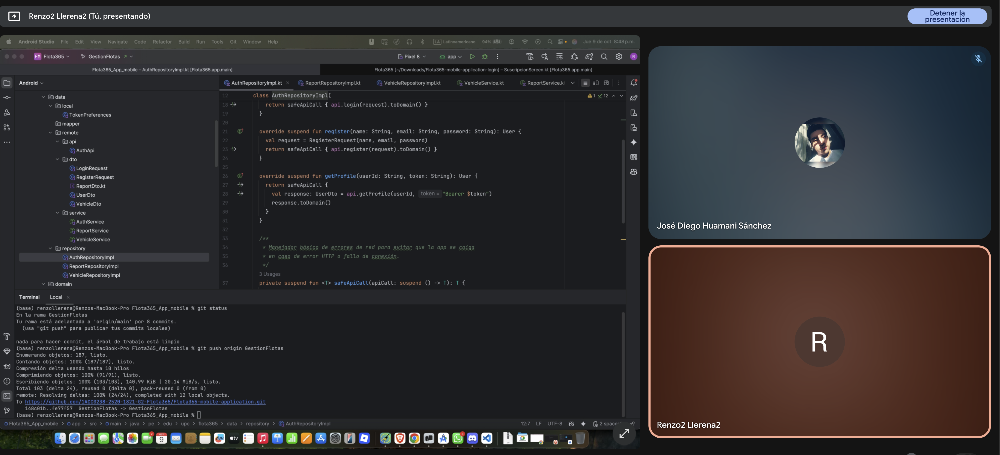
  
  * ### Requirement Management
    * ### Draw.io
    Se trata de una suite de herramientas que posibilita la creación colaborativa de modelos C4 para representar de forma gráfica nuestros productos.
    
    Imagen de evidencia de uso
  
    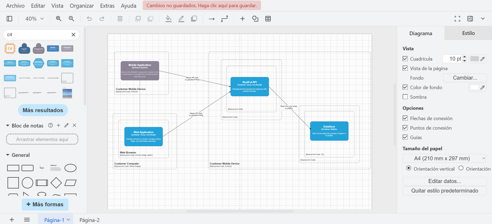
  
  * ### Product UX/UI Design
    * ### Figma
    Herramienta visual que facilita la creación de wireframes y mockups.
  
    Imagen de evidencia de uso
  
    
  
  * ### Software Development
    * ### HTML5
    Lenguaje de etiquetado orientado a crear páginas web.
  
    Imagen de evidencia de uso
  
    
  
    * ### CSS
    Lenguaje de diseño gráfico utilizado para dar formato al código escrito en HTML.
  
    Imagen de evidencia de uso
  
    
  
    * ### Javascript
    Lenguaje de programación orientado a objetos dinámico que utilizamos para implementar funcionalidades en un documento HTML.
  
    Imagen de evidencia de uso
  
    
  
  * ### Software Documentation
    * ### Github
    Plataforma utilizada para el alojamiento de versiones del código fuente de un proyecto. Es una herramienta ampliamente popular en el trabajo colaborativo de programadores.  

    
  
  * ### Software Documentation
    * ### Github Pages
    Una plataforma que posibilita la realización de despliegues simples directamente desde un repositorio de GitHub.  

    
    
### 4.1.2. Source Code Management

* ### **Gitflow Implementation:**
Implementamos el flujo de trabajo gitflow para el control de versiones con branches(ramas) para trabajar paralelamente.

  

### **Master o Main branch**
La rama principal de desarrollo del proyecto es la Master branch. En esta rama reside el código que actualmente se encuentra en producción.
#### Notación: master o main

### **Conventional Commits**
"Conventional Commits" es una convención para estructurar los mensajes de confirmación (commits) en un formato estándar y semántico. Este formato ayuda a comunicar claramente los cambios realizados en el código y facilita la generación de registros de cambios automáticos. Los "Conventional Commits" suelen seguir un formato que incluye un encabezado, un cuerpo opcional y un pie de página opcional, y se utilizan para describir de manera sucinta y clara los cambios realizados en el código, lo que facilita su seguimiento y comprensión por parte de los desarrolladores y otros miembros del equipo.
 
La estructura de un commit debe seguir las siguientes pautas:
~~~
git commit -m “<type>[optional scope]: <title>“ -m “<description”
~~~
**Tipos De Conventional Commits**
~~~
1. feat: Used to describe a new feature or functionality added to the code.
2. fix: Indicates a bug fix or solution to a problem.
3. docs: Employed for changes or improvements in code documentation.
4. style: Describes changes related to the code's formatting, such as whitespace, indentation, etc., that do not affect its functionality.
5. refactor: Used for modifications to the code that do not fix bugs or add new features, but rather improve its structure or readability.
6. test: Indicates the addition or modification of unit tests or functional tests.
7. chore: Used for changes in the build process or maintenance tasks that are not directly related to the code itself.
8. perf: Describes performance improvements in the code.
~~~

### 4.1.3. Source Code Style Guide & Conventions

- ### HTML 
    - #### Use Lowercase Element Names:
        Es recomendable utilizar minúsculas o lowercase para los nombres de los elementos HTML.
        ~~~ 
      <body>
            
This is a paragraph

      <body>
       ~~~
    - #### Close All HTML Elements:
        Es recomendable cerrar todos los elementos HTML correctamente.
        ~~~ 
      <body>
            
This is a paragraph

            
This is another paragraph

      <body>
       ~~~
    - #### Use Lowercase Attribute Names:
        Es recomendable utilizar minúsculas para los nombres de los atributos HTML.
      ~~~ 
      <a href="https://www.w3schools.com/html/">Visit our HTMLtutorial</a>
       ~~~
    - #### Always Specify alt, width, and height for Images:
      Es recomendable seguir estas convenciones en caso de que la imagen no se pueda mostrar, lo que ayuda a mejorar la accesibilidad del contenido.
      ~~~ 
      
      ~~~ 
    - #### Spaces and Equal Signs:
      Se recomienda no utilizar espacios en blanco entre las entidades para mejorar la legibilidad.
      ~~~ 
      <link rel="stylesheet" href="styles.css">
      ~~~ 
- ### CSS
    - #### ID and Class Naming
      Es recomendable utilizar nombres de clases e id's significativos que expresen claramente el propósito del elemento.
      ~~~ 
      #gallery {}
      #login {}
      .video {}
       ~~~
    - #### ID and Class Name Style
      Se recomienda utilizar nombres cortos para nombrar ids o clases, pero lo suficientemente descriptivos para entender su propósito.
      ~~~ 
      #nav {}
      .author {}
      ~~~
    - #### Shorthand Properties
      Se recomienda utilizar propiedades CSS de forma abreviada siempre que sea posible para hacer el código más eficiente y comprensible.
       ~~~ 
       border-top: 0;
       font: 100%/1.6 palatino, georgia, serif;
       padding: 0 1em 2em;
       ~~~ 
    - #### 0 and Units
      Es recomendable evitar especificar la unidad después del valor 0 en propiedades que lo permitan, ya que esto ayuda a reducir el tamaño del código y mejora su legibilidad.
       ~~~ 
       margin: 0;
       padding: 0;
       ~~~
     - #### Declaration Order
       Se recomienda ordenar las declaraciones en orden alfabético para facilitar el mantenimiento y la recordación del código.
       ~~~ 
        background: fuchsia;
        border: 1px solid;
        border-radius: 4px;
        color: black;
        text-align: center;
        text-indent: 2em;
       ~~~
- ### JAVASCRIPT
     - #### Use expanded syntax
       Cada línea de JavaScript debería estar en una nueva línea, con la llave de apertura en la misma línea de su declaración y la llave de cierre en una nueva línea al final.
       ~~~ 
       function myFunc() {
        console.log('Hello!');
       };
       ~~~
     - #### Variable naming
       Para el nombre de las variables, se recomienda utilizar lowerCamelCase. 
       ~~~ 
       let playerScore = 0;
       let speed = distance / time;
       ~~~  
     - #### Declaring variables
       Para la declaración de variables, es recomendable utilizar las palabras reservadas let y const en lugar de var.
       ~~~ 
       const myName = 'Chris';
       console.log(myName);
       let myAge = '40';
       myAge++;
       console.log('Happy birthday!');
       ~~~ 
     - #### Function naming
       Para el nombre de las funciones, se recomienda utilizar lowerCamelCase.
       ~~~ 
       function sayHello() {
       alert('Hello!');
       };
       ~~~
- ### LENGUAJE GHERKIN
    - #### Descriptive and concise titles for scenarios
      Utilizar títulos descriptivos y concisos para los escenarios.
      ~~~ 
      Feature: Login
        Scenario: Successful login
          Given a user is on the login page     
          When they enter valid credentials     
          Then they should be logged in successfully      
      ~~~
    - #### Follow the Given-When-Then structure consistently.
      Seguir la estructura de Given-When-Then de manera consistente.
      ~~~ 
      Scenario: Adding items to the shopping cart
        Given the user is on the shopping page
        When they add an item to the cart
        Then the item should appear in the cart 
      ~~~
    - #### Focus on business-readable language
      Centrarse en un lenguaje legible para el negocio, evitando detalles técnicos de implementación.
      ~~~ 
      Scenario: Changing user settingst
        Given the user is logged in
        When they navigate to the settings page
        Then they should be able to update their profile
      ~~~
    - ####  Utilize Scenario Outline for scenarios with multiple similar cases.
      Utilizar Scenario Outline para escenarios con múltiples casos similares.
      ~~~ 
      Scenario Outline: Searching for products
        Given the user is on the search page
        When they search for "<product>"
        Then they should see search results for "<product>"
      
      Examples:
        | product  |
        | Laptop   |
        | Smartphone |
      ~~~
    - #### Add comments to provide additional context
      Agregar comentarios para proporcionar contexto adicional o explicaciones cuando sea necesario.
      ~~~ 
      # This scenario checks the functionality of the logout feature
      Scenario: User logout
        Given the user is logged in
        When they click on the logout button
        Then they should be redirected to the login page      
      ~~~
      
### 4.1.4. Software Deployment Configuration

En esta sección encontramos el detalle de como será el proceso de configuración de despliegue de las soluciones propuestas por Flota365. Cada una cuenta con herramientas que, por familiaridad del equipo, utilizará para dar mayor agilidad en proudcción y que nuestros usuarios lo puedan estar utilizando lo más pronto posible en sus actividades rutinarias.

A continuación comenzaremos por:

**Landing Page**

El landing page se desplegará como una página web estática, haciendo uso de <a href="https://docs.github.com/es/pages">Github Pages</a>. Este producto de **Github** permite alojar aplicaciones web estáticas de forma sencilla y escalable, proporcionando un entorno escalable para el Landing Page de Flota365.

* Proceso de Despliegue:

1. En primer lugar, nos dirijimos a nuestro repostorio donde tenemos alojado nuestro *landing page* y procedemos a seleccionar la opción *Settings* de nuestro repositorio de Github.

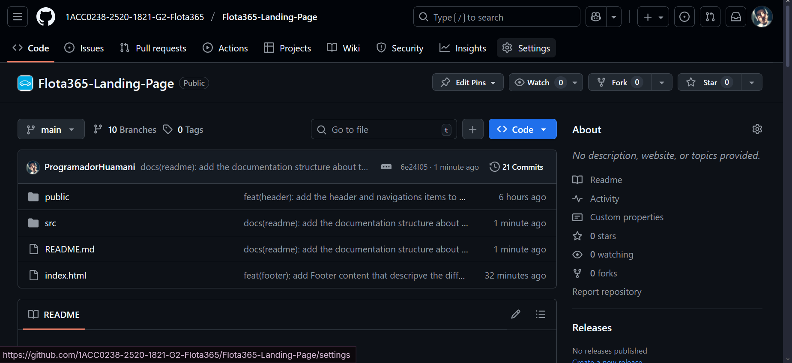

2. Dentro de dicho apartado, en el menú de la barra lateral procederemos a buscar la opción que tenga el nombre de *Pages*.

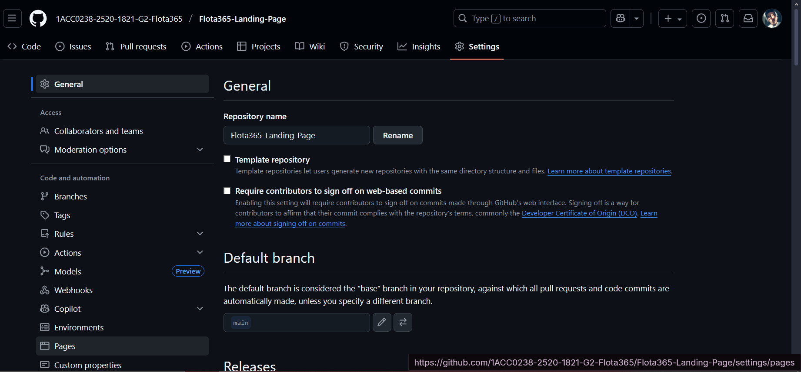

3. En el subtítulo que tenga el nombre de **Build and deployment**, en la parte de *branch*, seleccionaremos la rama que queremos desplegar nuestra solución - como nosotros usamos *conventional commits* y *conventional branches*, usamos la rama **main** como rama de despliegue a producción.
Adicional, seleccionamos a partir de que nivel de carpetas queremos que comience a monitorear Github nuestro proyecto que utilizará en el despliegue.

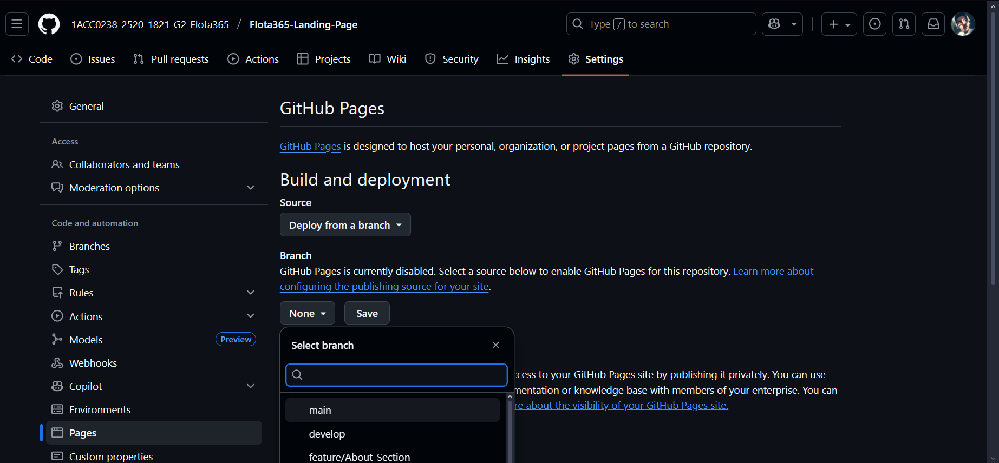

 

4. Finalmente, esperamos a que nuestra configuración sea procesada y nos brinde un enlace como este:

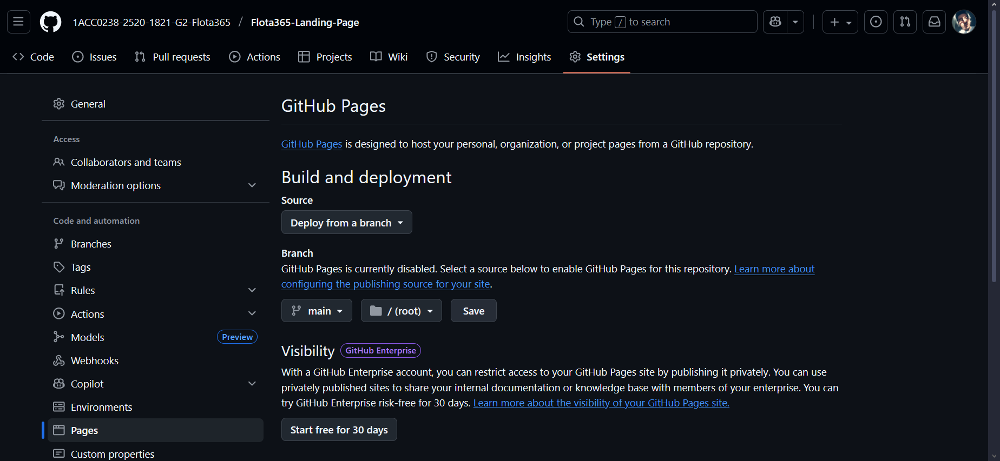

Con todos estos pasos, el despliegue de nuestra solución estará en cuestión de minutos y con la posiblidad de seguir escalando con más herramientas o servicios que nuestros amigos de **Github** tienen por ofrecernos.

## 4.2. Landing Page & Mobile Application Implementation
El desarrollo, testeo y despliegue de nuestra landing page es importante para que nuestros clientes puedan acceder a la información sobre nuestra empresa y producto a través de una interfaz con diseño responsivo, navegación intuitiva y solo con información relevante. Esta primera etapa nos permite crear un diseño conceptual sobre la estética que nuestra aplicación completa y lista para su uso. Estas etapas nos ayudaran a dar una primera impresión a los clientes para validar ideas e identificar problemas que se deben solucionar.  

### 4.2.1. Sprint 1

El primer sprint es una etapa importante en nuestro marco de gestión de proyectos de metodología ágil Scrum. En este periodo, agendamos reuniones con el objetivo de conocer mejor las características de cada integrante, y delegamos tareas para materializar el diseño y funcionalidades ya establecidas, para transformarlos en un landing page funcional y que cumple las heurísticas.  

#### 4.2.1.1. Sprint Planning 1

El sprint planning es una reunion antes de cada sprint en la metodologia Scrum donde el equipo elige las user stories que va a transformar en un producto tangible. Tambien define que como se van a separar los trabajos y quien sera responsable. Nuestro objetivo sera construir un plan resolubre en un tiempo determinado que sera lo que dure el sprint, para crearlo fomentaremos la colaboracion para que todos sepan y entiendas los objetivos y prioridades.  

| Sprint #| Sprint 1|
| -- | -- |
| **Sprint Planning Background**||
| **Date**| 01/10/2025|
| **Time**| 17:00 AM|
| **Location**| Discord (Reunión virtual)|
| **Prepared By**| Torres Apolinario, Giovany Smith|
| **Attendees (to planning meeting)** | Huamani Sánchez José Diego, Llerena Delgado Renzo Miguel, Comettant Rubiños Jessica Elizabeth, Villafuerte Tapia Renzo Alonso, Torres Apolinario Giovany Smith|
| **Sprint Goal & User Stories**||
| **Sprint 1 Goal**| Nuestro enfoque está en finalizar el informe , desplegar nuestra Landing Page desde el repositorio de GitHub y avanzar bounded context del aplicativo (Tanto IAM como applications). Creemos que esto entrega una experiencia de usuario optimizada a nuestros clientes. Esto se confirmará cuando todas las tareas se muevan a la columna "Terminado" en Trello. |
| **Sprint 1 Velocity**| ------ |
| **Sum of Story Points**| 19 |  

#### 4.2.1.2. Sprint Backlog 1

Durante el primer sprint backlog, reunimos las historias de usuario relacionadas con la página de inicio (landing page). Para facilitar su gestión y organización, las dividimos en tareas más simples y las asignamos a los integrantes del equipo de manera eficiente, utilizando la herramienta Trello. Nuestro enfoque principal fue completar estas historias de usuario en el sprint, con el propósito de desarrollar una landing page funcional, atractiva y fácil de navegar. Además, trabajamos en la elaboración del informe de entrega y en el desarrollo del front-end y back-end de los bounded context **IAM** y **Applications**. Gracias al uso de Trello, logramos una colaboración efectiva y un seguimiento claro del avance de las tareas, lo que nos permitió resolver los desafíos que surgieron durante el proceso.

 

| Sprint # | Sprint 1 |
|-----------|-----------|

| User Story |  | Work-Item / Task |  |  |  |  |  |
|-------------|--|------------------|--|--|--|--|--|
| ID | Title | ID | Title | Description | Estimation (Hours) | Assigned To | Status |
| --- | --- | --- | --- | --- | --- | --- | --- |
| US01 | Landing Page informativa | TA001 | Integración visual de landing page | Diseñar e implementar la estructura principal de la landing page informativa, incluyendo secciones de presentación y CTA. | 2 | Huamani Sánchez, José Diego | Done |
| US02 | Responsive | TA002 | Adaptación responsive del sitio | Implementar diseño responsive para dispositivos móviles y tablets, garantizando accesibilidad y buena experiencia de usuario. | 1 | Huamani Sánchez, José Diego | Done |
| US03 | Comparador de planes | TA003 | Desarrollo de módulo comparador | Crear un componente que permita comparar distintos planes o servicios mediante tablas dinámicas o tarjetas. | 4 | Torres Apolinario, Giovany Smith | Done |
| US04 | Switcher de idiomas | TA004 | Implementación de selector de idioma | Añadir un switcher que permita cambiar entre idiomas (por ejemplo, español e inglés) usando i18n o similar. | 3 | Comettant Rubiños, Jessica Elizabeth | Done |
| US05 | Tema de colores | TA005 | Configuración de paleta de colores | Definir y aplicar un sistema de temas (claro/oscuro) con variables globales de color y componentes adaptativos. | 2 | Comettant Rubiños, Jessica Elizabeth | Done |
| US06 | Vista de developers | TA006 | Construcción de vista para desarrolladores | Diseñar una vista con documentación técnica y herramientas de prueba para el equipo de desarrollo. | 3 | Torres Apolinario, Giovany Smith | Done |
| US07 | Registro de nuevo usuario | TA007 | Implementación del formulario de registro | Crear un formulario de registro con validaciones y conexión al backend para nuevos usuarios. | 3 | Renzo Miguel Llerena Delgado | Done |
| US09 | Registro de vehículo | TA008 | Formulario de registro vehicular | Desarrollar un formulario para registrar datos de vehículos con validación y confirmación visual. | 2 | Renzo Miguel Llerena Delgado | Done |
| US11 | Footer informativo | TA009 | Creación del pie de página informativo | Diseñar un footer con enlaces de contacto, políticas de privacidad y redes sociales. | 2 | Huamani Sánchez, José Diego  | Done |
| US12 | Información conductor | TA010 | Visualización de datos del conductor | Implementar componente que muestre información detallada del conductor (nombre, licencia, historial). | 1 | Renzo Alonso Villafuerte Tapia  | Done |
| US14 | Información del vehículo | TA011 | Módulo de detalles del vehículo | Crear una vista con los datos completos del vehículo: modelo, placa, estado y revisiones. | 3 | NARenzo Alonso Villafuerte Tapia ME | Done |

Link de Trello: https://trello.com/invite/b/68e3edd7fb5340b5154772f4/ATTI2ddb91b7af2a322ff81b700ac8f837b3DF4CD98A/sprint-1-flota365

#### 4.2.1.3. Development Evidence for Sprint Review
Landing Page:

|Repository |Branch| Commit Id | Commit Message| Commit Message Body| Date|
|----|-----|---------------------|----------------------------------------|---------------------------------------------------------|------------|
|Flota365/landing-page|develop| 2753d07           | feat(header): add the header and navigations  | the access with differents informative articles about Flota365 Startup | 05/10/2025 |
|Flota365/landing-page|develop| 184f6f5           | feat(hero): add the new version of Hero Section o n the Flota365 Landing Page         | Added hero section with headline | 05/10/2025 |
|Flota365/landing-page|develop| a831a7f           | feat(features): add the primordial features  | features of Flota365 offers our customers         | 05/10/2025 |
|Flota365/landing-page|develop| 74000b4           | feat(about): add the first vertion of About section    | Implemented company info section with team photos       | 05/10/2025 |
|Flota365/landing-page|develop| c5ab48a           | feat(contact): Add contact information | add the contact forms into the Landing Page of Flota465 | 05/10/2025 |
|Flota365/landing-page|develop| 3473e3f           | Chore(colors): update the color palette     | Implemented apply into the new navigation items  | 05/10/2025 |
|Flota365/landing-page|develop| 681332a           | feat(stats): add the stadistics   | Implemented information about the advantage to use Flota365   | 05/10/2025 |
|Flota365/landing-page|develop| 932bd47           | feat(team): add the group of developers | Implemented  team member of Flota365 into the Landing Page   | 05/10/2025 |
|Flota365/landing-page|develop| 71f42b3           | feat(footer): add Footer   | content that descripve the differents informative article about the service   | 05/10/2025 |

BackEnd: 
| Repository | Branch         | Commit Id | Commit Message                                               | Commit Message Body                                                                                                                                                                                                                                                                                                                                                                     | Date        |
|------------|---------------|-----------|----------------------------------------------------------------|-------------------------------------------------------------------------------------------------------------------------------------------------------------------------------------------------------------------------------------------------------------------------------------------------------------------------------------------------------------------------------------------|-------------|
| FlotaAPI   | main          | a6f0ca4   | chore: configurar gitignore para .NET y limpiar bin/obj       | Se añadió plantilla de .gitignore para proyectos .NET a fin de excluir bin/, obj/, .vs/, archivos de usuario (*.user) y artefactos de compilación.                                                                                                                                                                                                                                         | 06/10/2025  |
| FlotaAPI   | main          | 96ab590   | docs(readme): guía de ejecución local y migraciones EF Core   | Actualización de README-BACKEND.md con pasos para: variables de entorno, dotnet run, creación de migraciones, actualización de base de datos y URLs clave.                                                                                                                                                                                                                                | 06/10/2025  |
| FlotaAPI   | main          | 54991b1   | chore: inicializar proyecto base con estructura DDD           | Se creó la estructura inicial del proyecto siguiendo Domain-Driven Design, incluyendo las carpetas para Domain, Application, Infrastructure y API. También se configuraron los archivos base de gitignore y launch settings.                                                                                                                                                             | 07/10/2025  |
| FlotaAPI   | deploy-koyeb | e0f60d3   | Update Dockerfile                                           | Actualización del archivo Dockerfile para la configuración de despliegue.                                                                                                                                                                                                                                                                                                                  | 07/10/2025  |
| FlotaAPI   | deploy-koyeb | e23ff70   | Fix Dockerfile paths and set port for Koyeb                 | Corrección de rutas en el Dockerfile y establecimiento de puerto para despliegue en Koyeb.                                                                                                                                                                                                                                                                                                 | 07/10/2025  |
| FlotaAPI   | main          | 24d6996   | chore(security): configurar CORS para frontend local         | Se habilitó CORS en Program.cs permitiendo orígenes http://localhost:5173 y http://localhost:4200, métodos comunes (GET, POST, PUT, DELETE) y cabeceras necesarias para JWT. Esto permite la integración con el frontend en desarrollo.                                                                                                                                                      | 07/10/2025  |
| FlotaAPI   | main          | 797833c   | refactor(Extensions): métodos de extensión para DI, Swagger y CORS | Se movió la configuración repetida de Program.cs a la carpeta Extensions (AddSwagger, AddCorsPolicy, AddApplicationServices). Mejora de mantenibilidad y separación de responsabilidades. Program.cs queda más limpio y declarativo.                                                                                                                                                          | 07/10/2025  |
| FlotaAPI   | main          | 3132fba   | docs(api): documentar API con Swagger/OpenAPI y ejemplos     | Se habilitó Swagger con documentación de los módulos Auth, Fleets, DriverManagement, Assignments, Maintenance, Reporting y Dashboard. Se añadieron ejemplos de request/response y descripciones de códigos de estado. Disponible en /swagger.                                                                                                                                              | 07/10/2025  |
| FlotaAPI   | main          | 6a85612   | feat(): endpoint de métricas para tablero                    | Se añadió Dashboard con un endpoint /api/dashboard/metrics que consolida KPIs de Reporting (flotas, conductores, asignaciones, MTTR de mantenimiento). Ideal para la vista analítica del frontend. Incluye caché en memoria de 60 segundos.                                                                                                                                                | 07/10/2025  |
| FlotaAPI   | main          | 648ccf6   | refactor(Management): separar contratos (DTO/Command/Query) y servicios | Se reorganizó Management para adoptar CQRS ligero: comandos y queries separados, perfiles de AutoMapper y servicios de aplicación específicos. Mejora la claridad y testabilidad de la lógica.                                                                                                                                                                                             | 07/10/2025  |

#### 4.2.1.4. Testing Suite Evidence for Sprint Review
Evidencia de prueba unitaria al Flota365-API

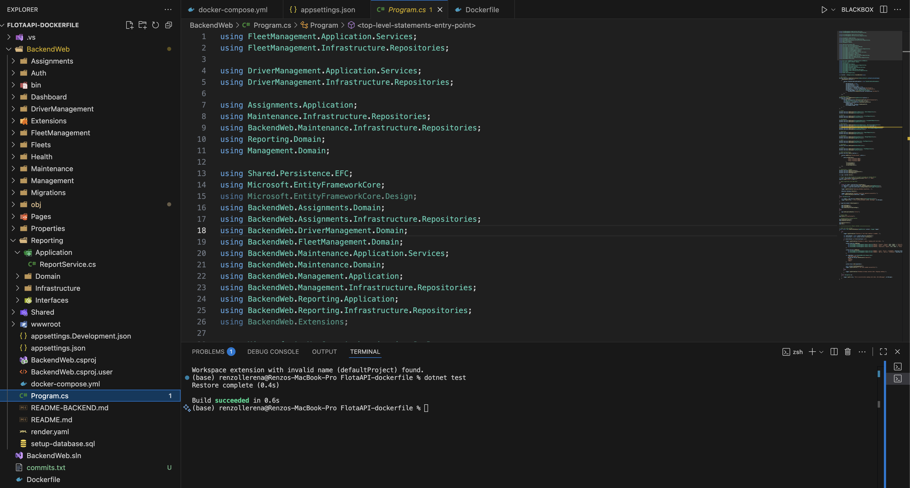
 

#### 4.2.1.5. Execution Evidence for Sprint Review

En este Sprint, los miembros del equipo de desarrollo de software de Aventis han completado y desplegado la Landing Page. A continuación, mostramos imágenes que demuestran cómo nuestra página presenta de manera clara e intuitiva la información sobre nuestro producto y nuestra empresa.

 

 

 

 

 

 

 

En segundo lugar ,se avanzo el bounded context IAM y applications tanto en backend como en frontend :

Backend - Swagger:

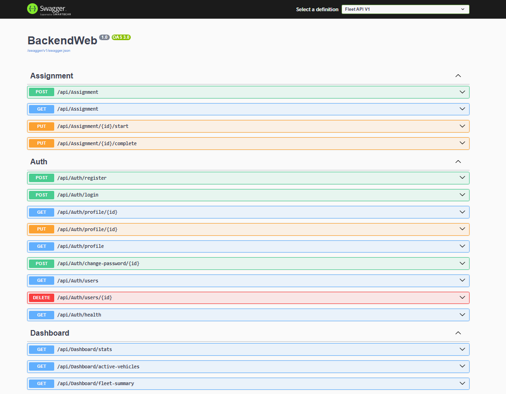 
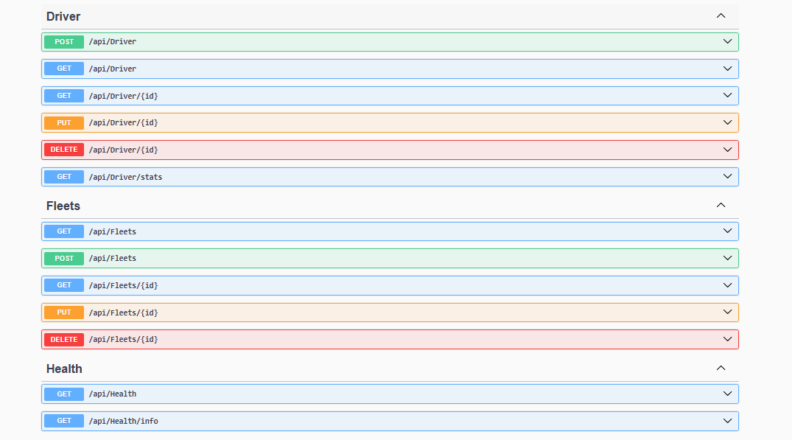 
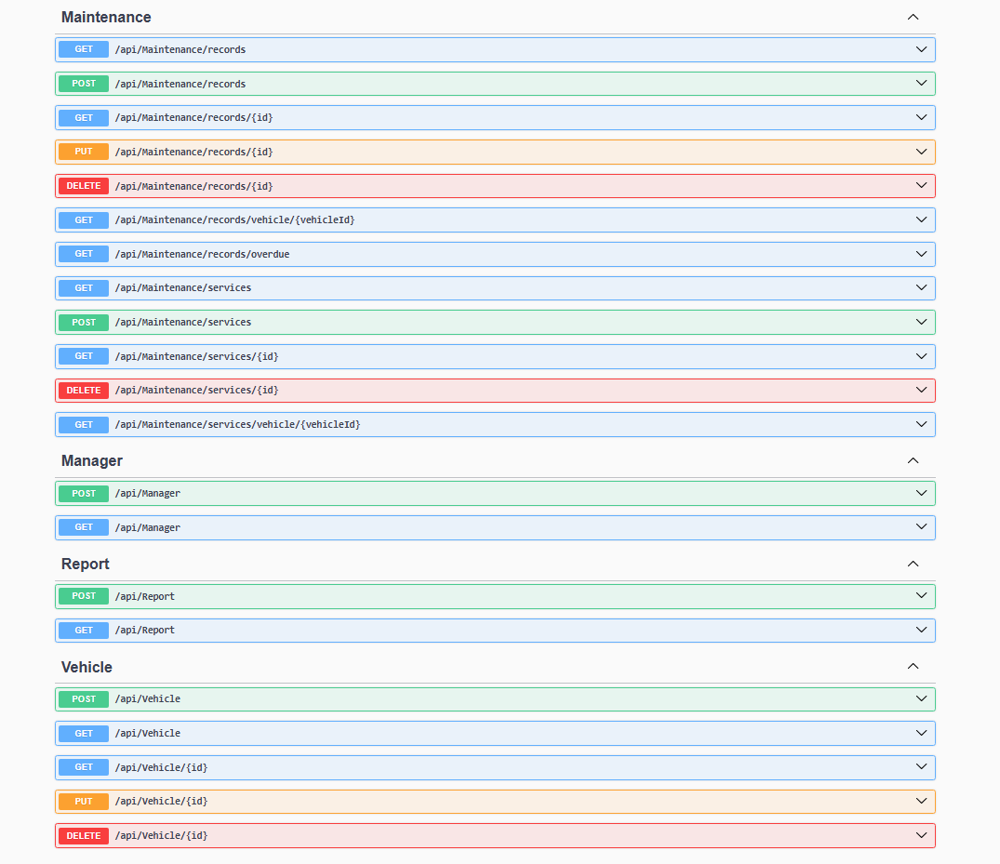 

Frontend - AndroidStudio:  

##### Pantalla de OnBoarding
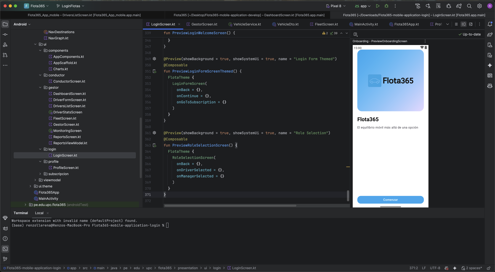
##### Pantalla de LoginWelcome
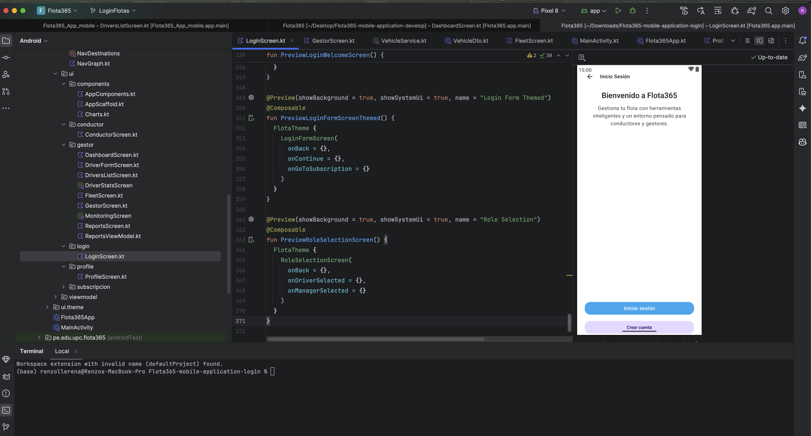
##### Pantalla de LoginForm
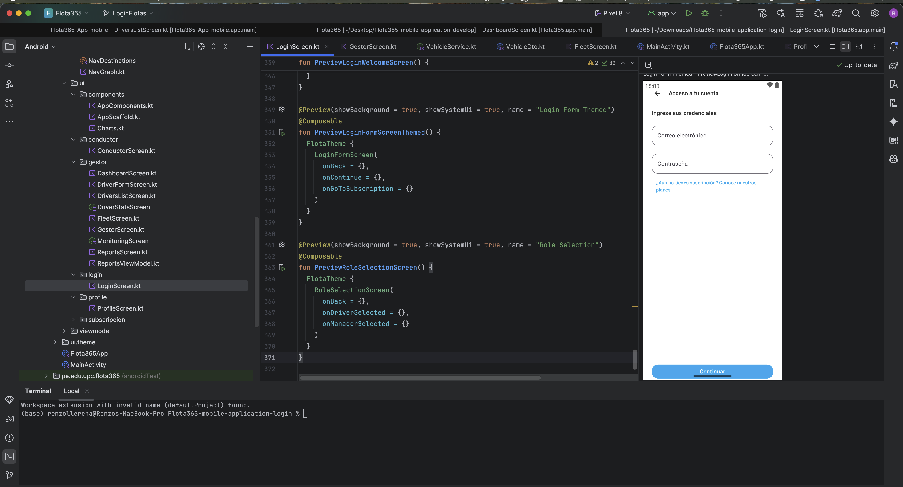
##### Pantalla de Reportes
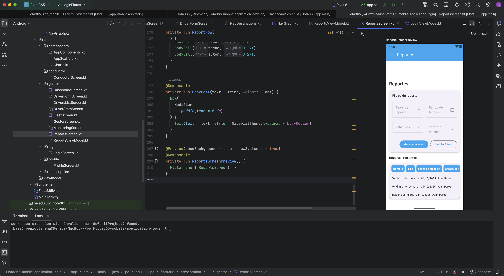
##### Pantalla de RoleSection
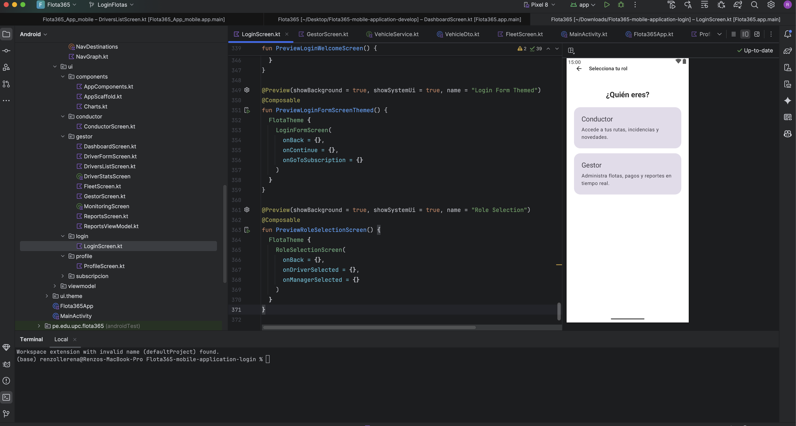
##### Pantalla de Dashboard
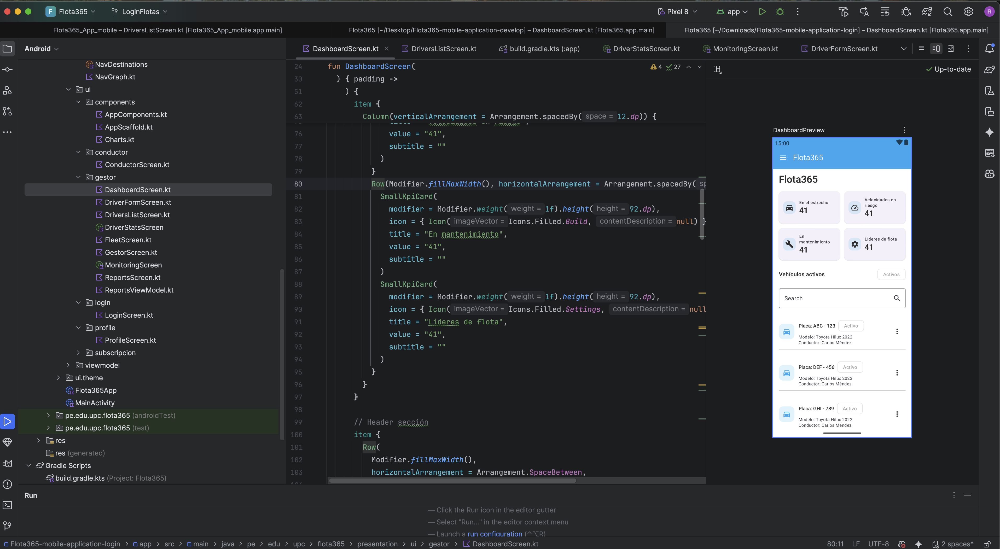
##### Pantalla de DriverFleet
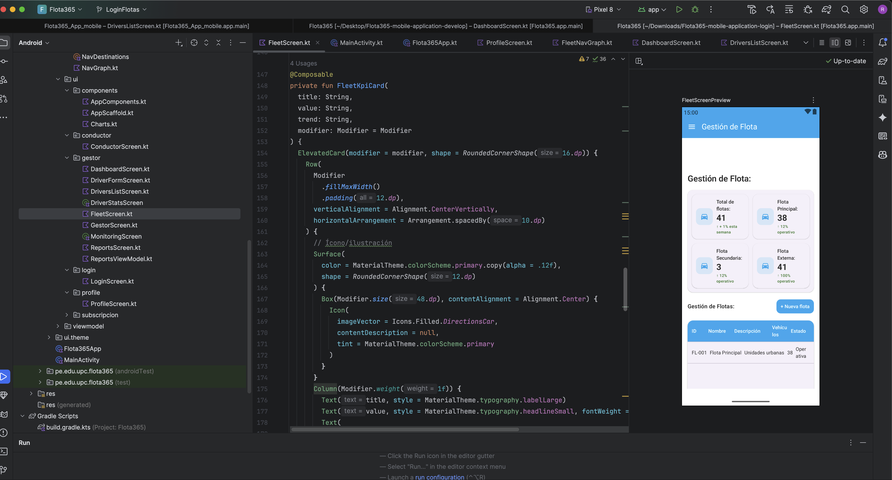
##### Pantalla de ManagerRegistration
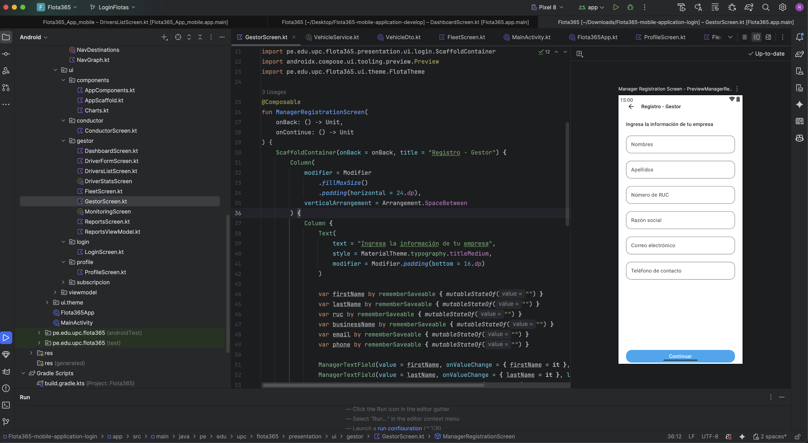

#### 4.2.1.6. Services Documentation Evidence for Sprint Review

En esta sección se presentan los endpoints desarrollados en el presente sprint y se adjuntan captura de las acciones CRUD realizadas con OpenAPI.

Se ajunta el enlace del repositorio de la API en Github: <a href="https://underground-tuesday-renworkplace-1e2821cb.koyeb.app/swagger/index.html">https://underground-tuesday-renworkplace-1e2821cb.koyeb.app/swagger/index.html</a>

<table border="1" style="border-collapse: collapse; text-align: left;">
  <thead>
    <tr>
      <th>Bounded Context</th>
      <td colspan="3">Auth</td>
    </tr>
    <tr>
      <th>Entity</th>
      <th>Endpoint URL</th>
      <th>Swagger</th>
    </tr>
  </thead>
  <tbody>
    <tr>
      <td>User</td>
      <td>
        POST: /api/Auth/register  
        POST: /api/Auth/login  
        GET: /api/Auth/profile/{id}  
        PUT: /api/Auth/profile/{id}  
        GET: /api/Auth/profile  
        POST: /api/Auth/change-password/{id}  
        GET: /api/Auth/users  
        DELETE: api/Auth/users/{id}  
        GET: /api/Auth/health
      </td>
      <td>
        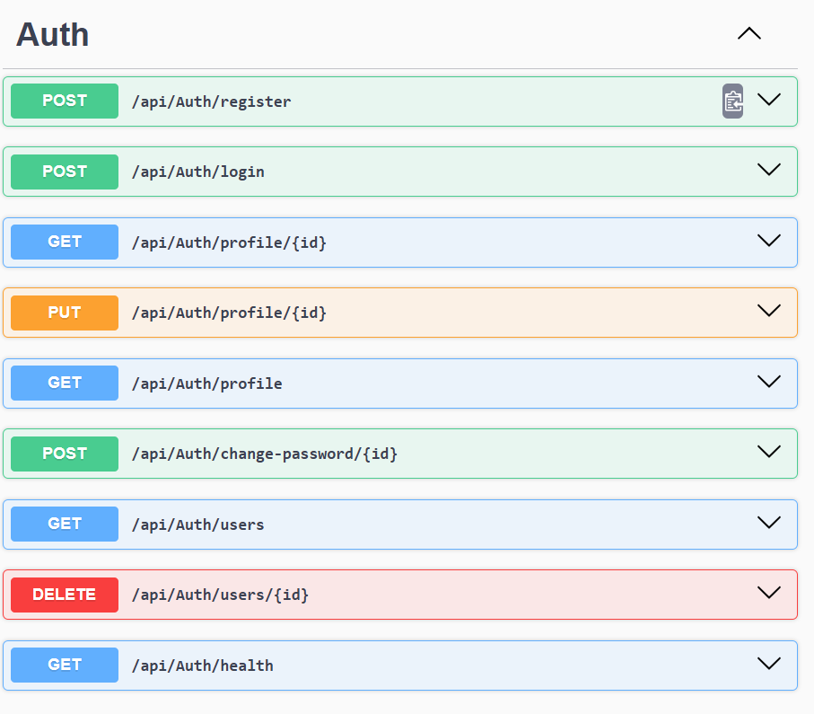
      </td>
    </tr>
  </tbody>
</table>

 

<table border="1" style="border-collapse: collapse; text-align: left;">
  <thead>
    <tr>
      <th>Bounded Context</th>
      <td colspan="3">Dashboard</td>
    </tr>
    <tr>
      <th>Entity</th>
      <th>Endpoint URL</th>
      <th>Swagger</th>
    </tr>
  </thead>
  <tbody>
    <tr>
      <td>User</td>
      <td>
        GET: /api/Dashboard/stats  
        GET: /api/Dashboard/active-vehicles  
        GET: /apu/Dashboard/fleet-summary
      </td>
      <td>
        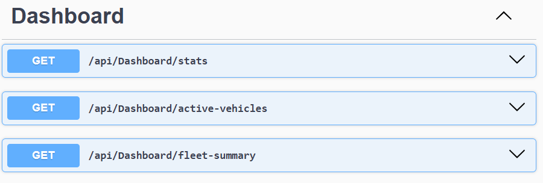
      </td>
    </tr>
  </tbody>
</table>

 

<table border="1" style="border-collapse: collapse; text-align: left;">
  <thead>
    <tr>
      <th>Bounded Context</th>
      <td colspan="3">Driver</td>
    </tr>
    <tr>
      <th>Entity</th>
      <th>Endpoint URL</th>
      <th>Swagger</th>
    </tr>
  </thead>
  <tbody>
    <tr>
      <td>User</td>
      <td>
        POST: /api/Drivers  
        GET: /api/Driver  
        GET: /api/Driver/{id}  
        PUT: /api/Driver/{id}  
        DELETE: /api/Driver/{id}  
        GET: /api/Driver/stats
      </td>
      <td>
        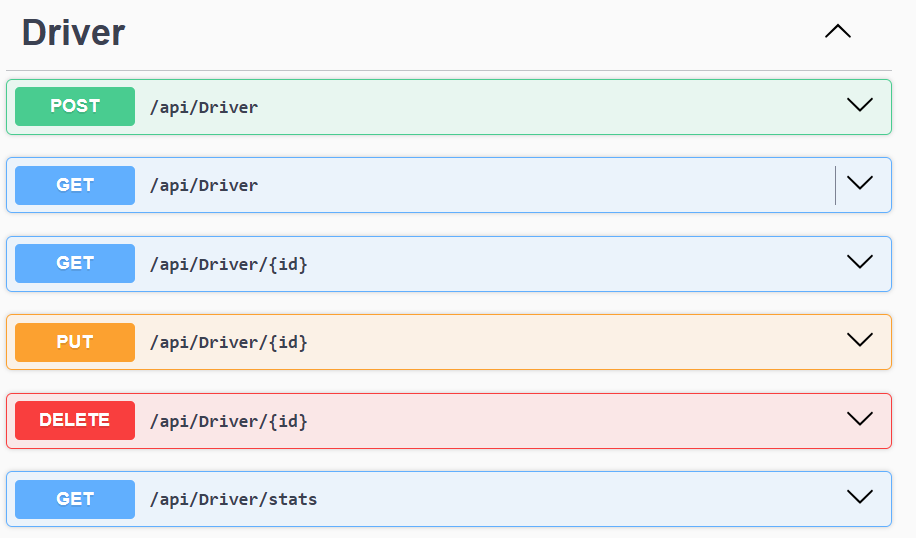
      </td>
    </tr>
  </tbody>
</table>

 

<table border="1" style="border-collapse: collapse; text-align: left;">
  <thead>
    <tr>
      <th>Bounded Context</th>
      <td colspan="3">Vehicle</td>
    </tr>
    <tr>
      <th>Entity</th>
      <th>Endpoint URL</th>
      <th>Swagger</th>
    </tr>
  </thead>
  <tbody>
    <tr>
      <td>User</td>
      <td>
        POST: /api/Vehicle  
        GET: /api/Vehice  
        GET: /api/Vehicle/{id}  
        PUT: /api/Vehicle/{id}  
        DELETE: /api/Vehicle/{id}
      </td>
      <td>
        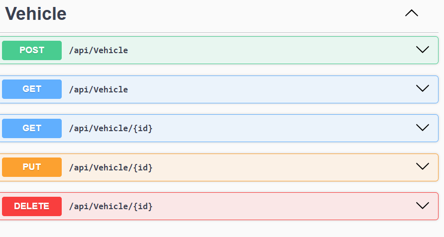
      </td>
    </tr>
  </tbody>
</table>

 

<table border="1" style="border-collapse: collapse; text-align: left;">
  <thead>
    <tr>
      <th>Bounded Context</th>
      <td colspan="3">Fleets</td>
    </tr>
    <tr>
      <th>Entity</th>
      <th>Endpoint URL</th>
      <th>Swagger</th>
    </tr>
  </thead>
  <tbody>
    <tr>
      <td>User</td>
      <td>
        GET: /api/Fleets  
        POST: /api/Fleets  
        GET: /api/Fleets/{id}  
        PUT: /api/Fleets/{id}  
        DELETE: /api/Fleets/{id}  
      </td>
      <td>
        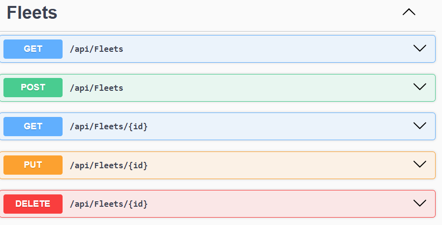
      </td>
    </tr>
  </tbody>
</table>

 

<table border="1" style="border-collapse: collapse; text-align: left;">
  <thead>
    <tr>
      <th>Bounded Context</th>
      <td colspan="3">Maintenance</td>
    </tr>
    <tr>
      <th>Entity</th>
      <th>Endpoint URL</th>
      <th>Swagger</th>
    </tr>
  </thead>
  <tbody>
    <tr>
      <td>User</td>
      <td>
        GET: /api/Maintenance/records  
        POST: /api/Maintenance/records  
        GET: /api/Maintenance/records/{id}  
        PUT: /api/Maintenance/records/{id}  
        DELETE: /api/Maintenance/records/{id}  
        GET: /api/Maintenance/records/{id}  
        GET: /api/Maintenance/records/vehicles/{vehicleId}  
        GET: /api/Maintenance/records/overdue  
        GET: /api/Maintenance/services  
        POST: /api/Maintenance/services  
        GET: /api/Maintenance/services/{id}  
        DELETE: /api/Maintenance/services/{id}  
        GET: /api/Maintenance/services/vehicle/{vehicleId}  
      </td>
      <td>
        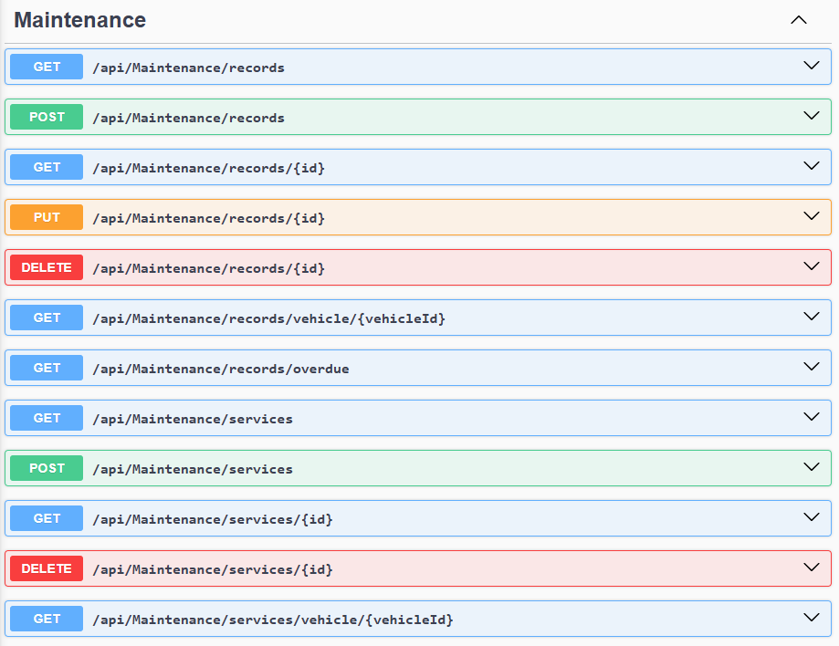
      </td>
    </tr>
  </tbody>
</table>

 

<table border="1" style="border-collapse: collapse; text-align: left;">
  <thead>
    <tr>
      <th>Bounded Context</th>
      <td colspan="3">Manager</td>
    </tr>
    <tr>
      <th>Entity</th>
      <th>Endpoint URL</th>
      <th>Swagger</th>
    </tr>
  </thead>
  <tbody>
    <tr>
      <td>User</td>
      <td>
        POST: /api/Manager  
        GET: /api/Manager
      </td>
      <td>
        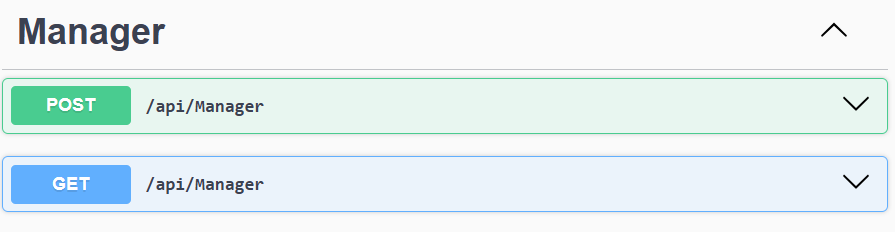
      </td>
    </tr>
  </tbody>
</table>

 

<table border="1" style="border-collapse: collapse; text-align: left;">
  <thead>
    <tr>
      <th>Bounded Context</th>
      <td colspan="3">Report</td>
    </tr>
    <tr>
      <th>Entity</th>
      <th>Endpoint URL</th>
      <th>Swagger</th>
    </tr>
  </thead>
  <tbody>
    <tr>
      <td>User</td>
      <td>
        POST: /api/Report  
        GET: /api/Report
      </td>
      <td>
        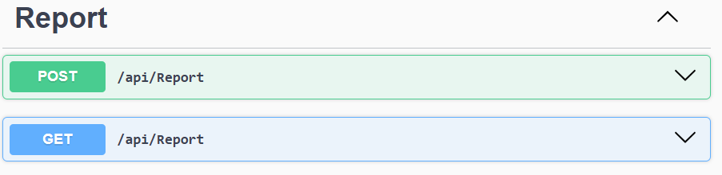
      </td>
    </tr>
  </tbody>
</table>

 

<table border="1" style="border-collapse: collapse; text-align: left;">
  <thead>
    <tr>
      <th>Bounded Context</th>
      <td colspan="3">Health</td>
    </tr>
    <tr>
      <th>Entity</th>
      <th>Endpoint URL</th>
      <th>Swagger</th>
    </tr>
  </thead>
  <tbody>
    <tr>
      <td>User</td>
      <td>
        GET: /api/Health  
        GET: /api/Health/info
      </td>
      <td>
        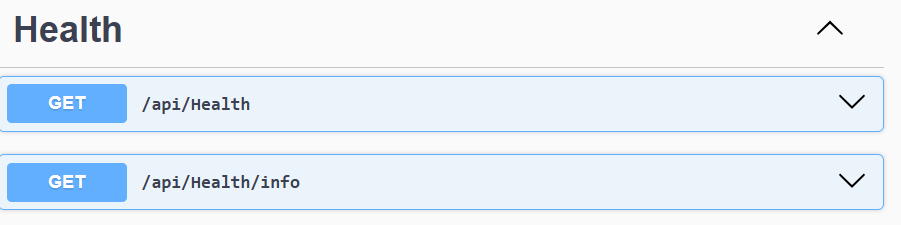
      </td>
    </tr>
  </tbody>
</table>

<table border="1" style="border-collapse: collapse; text-align: left;">
  <thead>
    <tr>
      <th>Bounded Context</th>
      <td colspan="3">Assignment</td>
    </tr>
    <tr>
      <th>Entity</th>
      <th>Endpoint URL</th>
      <th>Swagger</th>
    </tr>
  </thead>
  <tbody>
    <tr>
      <td>User</td>
      <td>
        POST: /api/Assignment  
        GET: /api/Assignment  
        PUT: /api/Assignment/{id}/start  
        PUT: /api/Assignment/{ID}/complete
      </td>
      <td>
        
      </td>
    </tr>
  </tbody>
</table>

#### 4.2.1.7. Software Deployment Evidence for Sprint Review

**Resumen**

Durante este Sprint, el equipo se centró en la implementación y despliegue de la landing page. Las tareas incluyeron la preparación del entorno, la configuración de recursos y la publicación inicial del sitio web. A continuación, se detalla el proceso seguido para completar el despliegue de la landing page.

---

## **Actividades Realizadas**

### **Creación de Cuentas y Configuración de Recursos**
- **Proveedor de Hosting:** Se seleccionó y configuró el servicio de hosting encargado de alojar la landing page.  
- **Entorno de Trabajo:** Se establecieron los entornos de desarrollo y producción para facilitar las pruebas y futuras actualizaciones.

### **Configuración de Proyectos para Integración**
- **Repositorio de Código:** Se configuró un repositorio en GitHub para gestionar versiones e integrar procesos de despliegue continuo.  
- **Automatización:** Se implementaron scripts y herramientas que permiten automatizar el proceso de despliegue, reduciendo errores manuales.

### **Despliegue de la Landing Page**
- **Carga de Archivos:** Se transfirieron los archivos y recursos necesarios al servidor de hosting.  
- **Verificación:** Se realizaron pruebas de funcionamiento para garantizar que la landing page se desplegara correctamente y estuviera accesible en la web.

**Deploy del Landing Page**

 

**Capturas de Pantalla**

- Repositorio de Landing Page:
  

**Enlace al Repositorio**: https://github.com/1ACC0238-2520-1821-G2-Flota365/Flota365-Landing-Page

**Link deploy Landing Page:** https://1acc0238-2520-1821-g2-flota365.github.io/Flota365-Landing-Page/

#### 4.2.1.8. Team Collaboration Insights during Sprint

En esta sección se muestra un análisis detallado del trabajo colaborativo realizado por el equipo durante el Sprint. Las actividades se gestionaron bajo una metodología ágil, lo que facilitó una comunicación constante y una coordinación eficiente entre los integrantes. Se presentan además capturas de los analíticos de colaboración y de los commits en GitHub, que reflejan las aportaciones individuales de cada miembro.

---

### **Diseño y Desarrollo**

- **Frontend:** Desarrollo integral de la landing page, abarcando la creación de secciones, aplicación de estilos y adaptación responsive para distintos dispositivos.  
- **Backend:** Implementación de funcionalidades esenciales junto con la configuración inicial del servidor y los servicios requeridos.  
- **Codificación:** Ejecución de tareas de programación, pruebas funcionales y mejoras iterativas durante el proceso de desarrollo.  

---

### **Documentación y Despliegue**

- **Documentación:** Elaboración de documentación técnica y visual con descripciones detalladas y evidencias gráficas del proceso.  
- **Despliegue:** Configuración y puesta en marcha del entorno de pruebas, asegurando el funcionamiento integrado del frontend y backend.  

**Landing Page**

**Report:**

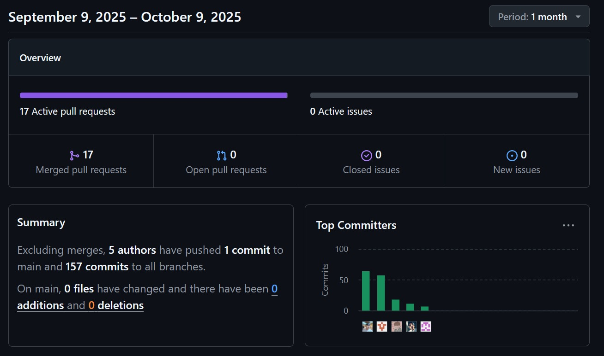

**Backend**

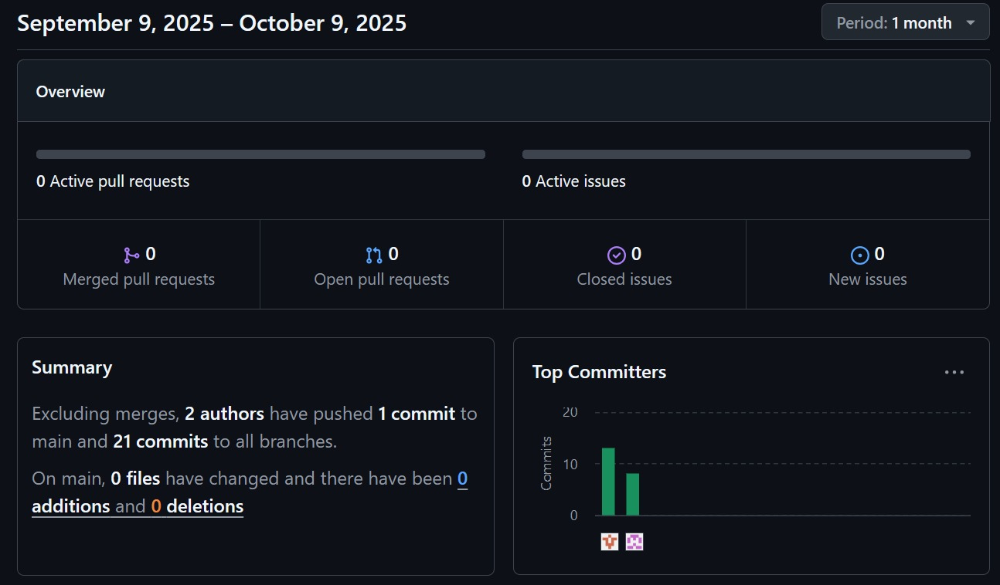

**Mobile App**

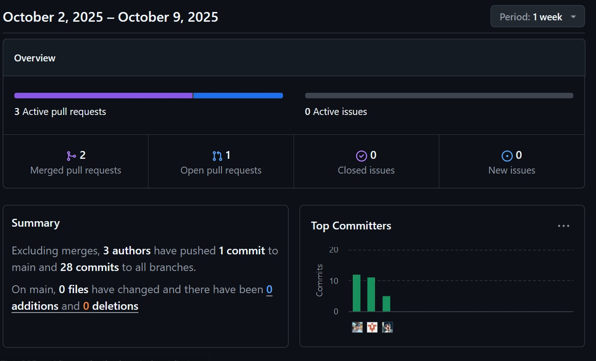

## 4.3. Validation Interviews

Para validar nuestros entregables, realizaremos entrevistas con nuestros segmentos objetivos, los cuales vienen a ser: Gestores de Flota y Conductores de vehículos pesados. El propósito es recopilar su opinión sobre la utilidad, claridad y facilidad de uso de solución propuesta por el team Flota365.

Las preguntas se plantearán de forma cercana pero estructurada, buscando obtener un feedback honesto sobre aspectos como la navegación, el diseño, la funcionalidad y el valor percibido en su trabajo diario.

Es por ello que, a continuación, se detallarán las preguntas y los principales hallazgos obtenidos a partir de sus respuestas.

### 4.3.1. Diseño de Entrevistas

Segmento encontrado: 

- Gestores de flota

- Conductores de vehículos pesados

Antes de realizar las entrevistas, consideramos necesario realizar un análisis previo que nos permita entender mejor a nuestros públicos objetivo. Para ello, hemos diseñado una serie de preguntas específicas para cada segmento (gestores de flota y conductores de vehículos pesados), con el fin de orientar nuestras entrevistas de manera más eficiente y alineada a sus realidades operativas.

En particular, previo a entrevistar a nuestro segmento principal de gestores de flota, consideramos importante contar con un primer prototipo funcional de nuestra plataforma de gestión vehicular. Este prototipo será probado por usuarios reales de ambos segmentos, y en ese contexto proponemos una batería de preguntas cualitativas orientadas a observar el uso de la solución (registro de incidencias, seguimiento de mantenimientos, disponibilidad de datos para decisiones en tiempo real), identificar posibles puntos de fricción y validar nuestras suposiciones de diseño.

Las siguientes preguntas están organizadas según los dos segmentos clave del proyecto (gestores de flota y conductores) y nos permitirán recoger percepciones reales sobre la experiencia de uso inicial, facilitando así un proceso iterativo de mejora del producto, con foco en la reducción de tiempos muertos, la prevención de fallas y la optimización del control operativo de la flota.

## Segmento 1 — Gestores de flota (uso en app)

### 1) Primera impresión y registro
- ¿Cómo describirías tu experiencia inicial al abrir la app por primera vez?
- ¿El registro de tu perfil y de la empresa fue claro desde el teléfono? ¿Qué pasos te generaron dudas?
- ¿El tour inicial o ayudas en pantalla te orientaron para empezar?

### 2) Inicio de sesión y pantalla principal
- Al iniciar sesión, ¿qué fue lo primero que notaste del **tablero** (estado de flota, alertas, mantenimientos, incidencias)?
- ¿Identificaste rápido las **prioridades del día** (vehículos con alerta, mantenimientos próximos, incidencias abiertas)?
- ¿Qué mejorarías de la pantalla principal para tomar decisiones más rápido desde el móvil?

### 3) Navegación general
- ¿Pudiste moverte por la app sin ayuda? ¿En qué momento te perdiste o no supiste qué hacer?
- ¿Qué tan fácil fue encontrar **Reportes**, **Mantenimientos**, **Incidencias** y **Conductores**?
- ¿Localizaste el **tutorial** o **centro de ayuda** dentro del menú? ¿Fue útil?

### 4) Configuración de flota en app
- ¿Cómo te fue configurando **vehículos** (placa, odómetro, póliza/seguro, vencimientos) desde el teléfono?
- ¿Fue claro **asignar conductores** a vehículos y definir **umbrales** (km/días) para mantenimiento?
- ¿Qué datos pedirías menos/antes para hacerlo más rápido en móvil?

### 5) Alta de vehículos y confirmaciones
- ¿El flujo para **agregar/editar vehículos** fue evidente y confiable?
- ¿Los **mensajes de confirmación** (guardado, cambios, errores) son claros en app?
- ¿Necesitas ver una **bitácora de cambios** en móvil para confiar en el registro?

### 6) Usabilidad y percepción general
- ¿La app se percibe **rápida, fluida y estable**? ¿En qué momento se sintió lenta?
- ¿Qué funciones te resultaron más útiles en el día a día (alertas de mantenimiento, costos, incidencias, KPIs)?
- Si pudieras **reordenar** secciones o accesos rápidos, ¿qué pondrías primero?

### 7) Seguridad y confianza
- ¿Qué te haría sentir mayor seguridad en app (roles y permisos, 2FA, registros de auditoría)?
- ¿Qué nivel de detalle necesitas en **notificaciones** (p. ej., “mantenimiento programado”, “incidencia cerrada”)?

### 8) Interés y adopción futura
- ¿La app te ayudaría a **reducir tiempos muertos, costos de mantenimiento o siniestros**? ¿Por qué?
- ¿La recomendarías a otros gestores de tu organización? ¿Qué condiciones (precio, soporte, integraciones) serían clave?

---

## Segmento 2 — Conductores de vehículos pesados (app)

### 1) Primera impresión y registro
- ¿Cómo describirías tu experiencia inicial al abrir la app?
- ¿El registro y la **asignación del vehículo** fueron claros desde el teléfono?
- ¿El **tour** o ejemplos (fotos de referencia, campos sugeridos) te ayudaron a empezar?

### 2) Inicio de sesión y pantalla principal
- Al iniciar sesión, ¿pudiste identificar qué hacer primero (p. ej., **checklist preoperacional**, reporte de km, cargar combustible)?
- ¿Las **alertas del vehículo** (luces de check, vencimientos) se entienden de un vistazo?

### 3) Navegación general
- ¿Pudiste moverte sin ayuda? ¿En qué punto te perdiste?
- ¿Qué tan fácil fue encontrar el botón de **Reportar incidencia**, el **Historial** y el **tutorial**?

### 4) Formularios del conductor
- ¿Cómo te fue con los formularios de **checklist pre y post viaje**, **odómetro**, **fotos** y **comentarios**?
- ¿Qué campos te parecieron innecesarios o repetidos?
- ¿Qué evidencias (fotos, videos, audio) te gustaría adjuntar de forma más rápida?

### 5) Reporte de incidencias y comunicación
- ¿El flujo para **enviar una incidencia** fue claro y rápido?
- ¿La **confirmación** de envío te dio confianza (número de ticket, estado, tiempo estimado)?
- ¿Cuánto tiempo sueles perder contactando a tu jefe por un problema? ¿La app lo reduce?

### 6) Usabilidad y percepción general
- ¿La app se mantuvo **rápida y usable** durante la ruta (conectividad limitada, modo offline)?
- ¿Qué funciones fueron más útiles (alertas de mantenimiento, checklist guiado, mensajería, mapas, historial)?
- ¿Qué eliminarías o simplificarías?

### 7) Seguridad y confianza
- ¿Qué te haría sentir más seguro: **confirmaciones claras**, **contacto rápido con taller/soporte**, **botón SOS**?
- ¿Cómo te sientes con el **GPS** y el registro de datos del vehículo? ¿Qué transparencia esperas sobre su uso?

### 8) Interés y uso futuro
- Si la app mostrara **estado del vehículo**, **próximo mantenimiento** y **alertas** en tiempo real, ¿la usarías a diario? ¿Por qué?
- ¿La recomendarías a otros conductores? ¿Qué la haría **imprescindible** para ti?

---

### 4.3.2. Registro de Entrevistas

#### Segmento Objetivo 1: Gestores de flota

##### Entrevistado 1 Segmento Objetivo 1

| **Campo**                | **Detalle** |
|--------------------------|-------------|
| **Nombre**               | Ariana Ramirez|
| **Entrevistador**        | Renzo Miguel Llerena Delgado |
| **Edad**                 | 28 años |
| **Distrito**             | San Juan de Miraflores|
| **Resumen**              | A Ariana le parece que a nuestra aplicacion le faltaria añadir mas interfaz visual como para una aplicacion movil ya que algunas interfaces le parecen confusas y que sigamos desarrollando la funcion de rastreo de vehiculos por medio de gps |
| **Duración de la entrevista** | 08:22 minutos |
| **URL de la entrevista** | [Ver entrevista](https://drive.google.com/file/d/1wB30wOJnFaTQuDe239yptUSicUAx_fVO/view?usp=sharing) |

| **Campo**                | **Detalle** |
|--------------------------|-------------|
| **Nombre**               | Renato Calvo|
| **Entrevistador**        | Renzo Miguel Llerena Delgado |
| **Edad**                 | 25 años |
| **Distrito**             | San Isidro|
| **Resumen**              | A Renato le parece intuitiva la aplicación y recomendaría a sus compañeros, gestores de flota, su uso. Lo único que cree que se puede mejorar es el aspecto de reportes que le parece un poco desordenado el aspecto visual|
| **Duración de la entrevista** | 07:09 minutos |
| **URL de la entrevista** | [Ver entrevista]([https://drive.google.com/file/d/1wB30wOJnFaTQuDe239yptUSicUAx_fVO/view?usp=sharing](https://drive.google.com/file/d/1UhtyC9_bsUVF8azpNJjpUdbOfvqsse6R/view?usp=sharing)) |

#### Segmento Objetivo 2: Conductores de vehículos pesados

##### Entrevistado 1 Segmento Objetivo 2

| **Campo**                | **Detalle** |
|--------------------------|-------------|
| **Nombre**               | Eduard Ancasi Carrión|
| **Entrevistador**        | Renzo Miguel Llerena Delgado |
| **Edad**                 | 28 años |
| **Distrito**             | San Juan de Miraflores|
| **Resumen**              | Eduard es conductor de vehículos pesados que trabaja en Shalon, le parece a el que nuestro avance necesita implementar la funcion de inteligencia artifical de forma completa, ya que el observa que eso sería un gran cambio con respecto a como podría trabajar el en su empresa, y que habría demasiada demanda si encuentran el servicio a un precio accesible para poder usarlo. Le parece que nuestra aplicacion movil necesita tener una estructura más organizada para facilitar el uso de gente inexperta con la tecnología y también implementando la funcionalidad de la ia|
| **Tiempo que empieza**   | 0:00 minutos |
| **Duración de la entrevista** | 08:30 minutos |
| **URL de la entrevista** | [Ver entrevista](https://drive.google.com/file/d/1lUyPkyNbrGfA9RZqERBFRNFBWAkkM0x7/view?usp=sharing) |

