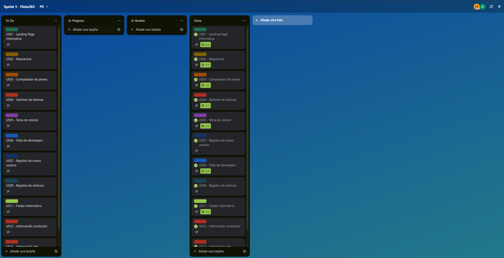
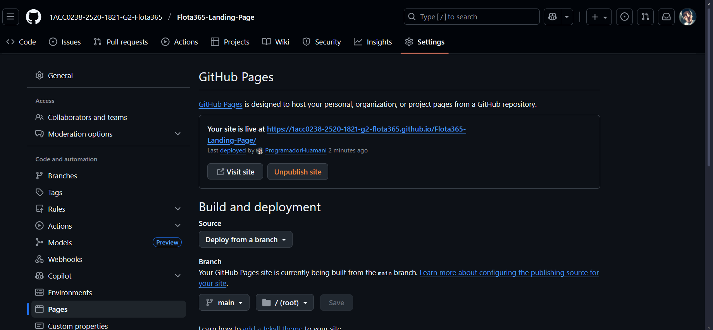

# 4. Product Implementation & Validation

## 4.1. Software Configuration Management
### 4.1.1. Software Development Environment Configuration
### 4.1.2. Source Code Management
### 4.1.3. Source Code Style Guide & Conventions
### 4.1.4. Software Deployment Configuration

## 4.2. Landing Page & Mobile Application Implementation
### 4.2.1. Sprint n
#### 4.2.1.1. Sprint Planning n
#### 4.2.1.2. Sprint Backlog n
#### 4.2.1.3. Development Evidence for Sprint Review
#### 4.2.1.4. Testing Suite Evidence for Sprint Review
#### 4.2.1.5. Execution Evidence for Sprint Review
#### 4.2.1.6. Services Documentation Evidence for Sprint Review
#### 4.2.1.7. Software Deployment Evidence for Sprint Review
#### 4.2.1.8. Team Collaboration Insights during Sprint

## 4.3. Validation Interviews
### 4.3.1. Diseño de Entrevistas
### 4.3.2. Registro de Entrevistas
### 4.3.3. Evaluaciones según heurísticas
# 4. Product Implementation & Validation

## 4.1. Software Configuration Management
### 4.1.1. Software Development Environment Configuration
### 4.1.2. Source Code Management
### 4.1.3. Source Code Style Guide & Conventions
### 4.1.4. Software Deployment Configuration

## 4.2. Landing Page & Mobile Application Implementation
El desarrollo, testeo y despliegue de nuestra landing page es importante para que nuestros clientes puedan acceder a la información sobre nuestra empresa y producto a través de una interfaz con diseño responsivo, navegación intuitiva y solo con información relevante. Esta primera etapa nos permite crear un diseño conceptual sobre la estética que nuestra aplicación completa y lista para su uso. Estas etapas nos ayudaran a dar una primera impresión a los clientes para validar ideas e identificar problemas que se deben solucionar.  

### 4.2.1. Sprint 1

El primer sprint es una etapa importante en nuestro marco de gestión de proyectos de metodología ágil Scrum. En este periodo, agendamos reuniones con el objetivo de conocer mejor las características de cada integrante, y delegamos tareas para materializar el diseño y funcionalidades ya establecidas, para transformarlos en un landing page funcional y que cumple las heurísticas.  

#### 4.2.1.1. Sprint Planning 1

El sprint planning es una reunion antes de cada sprint en la metodologia Scrum donde el equipo elige las user stories que va a transformar en un producto tangible. Tambien define que como se van a separar los trabajos y quien sera responsable. Nuestro objetivo sera construir un plan resolubre en un tiempo determinado que sera lo que dure el sprint, para crearlo fomentaremos la colaboracion para que todos sepan y entiendas los objetivos y prioridades.  

| Sprint #| Sprint 1|
| -- | -- |
| **Sprint Planning Background**||
| **Date**| 01/10/2025|
| **Time**| 17:00 AM|
| **Location**| Discord (Reunión virtual)|
| **Prepared By**| Torres Apolinario, Giovany Smith|
| **Attendees (to planning meeting)** | Huamani Sánchez José Diego, Llerena Delgado Renzo Miguel, Comettant Rubiños Jessica Elizabeth, Villafuerte Tapia Renzo Alonso, Torres Apolinario Giovany Smith|
| **Sprint Goal & User Stories**||
| **Sprint 1 Goal**| Nuestro enfoque está en finalizar el informe , desplegar nuestra Landing Page desde el repositorio de GitHub y avanzar bounded context del aplicativo (Tanto IAM como applications). Creemos que esto entrega una experiencia de usuario optimizada a nuestros clientes. Esto se confirmará cuando todas las tareas se muevan a la columna "Terminado" en Trello. |
| **Sprint 1 Velocity**| ------ |
| **Sum of Story Points**| 19 |  

#### 4.2.1.2. Sprint Backlog 1

Durante el primer sprint backlog, reunimos las historias de usuario relacionadas con la página de inicio (landing page). Para facilitar su gestión y organización, las dividimos en tareas más simples y las asignamos a los integrantes del equipo de manera eficiente, utilizando la herramienta Trello. Nuestro enfoque principal fue completar estas historias de usuario en el sprint, con el propósito de desarrollar una landing page funcional, atractiva y fácil de navegar. Además, trabajamos en la elaboración del informe de entrega y en el desarrollo del front-end y back-end de los bounded context **IAM** y **Applications**. Gracias al uso de Trello, logramos una colaboración efectiva y un seguimiento claro del avance de las tareas, lo que nos permitió resolver los desafíos que surgieron durante el proceso.

 

| Sprint # | Sprint 1 |
|-----------|-----------|

| User Story |  | Work-Item / Task |  |  |  |  |  |
|-------------|--|------------------|--|--|--|--|--|
| ID | Title | ID | Title | Description | Estimation (Hours) | Assigned To | Status |
| --- | --- | --- | --- | --- | --- | --- | --- |
| US01 | Landing Page informativa | TA001 | Integración visual de landing page | Diseñar e implementar la estructura principal de la landing page informativa, incluyendo secciones de presentación y CTA. | 2 | Huamani Sánchez, José Diego | Done |
| US02 | Responsive | TA002 | Adaptación responsive del sitio | Implementar diseño responsive para dispositivos móviles y tablets, garantizando accesibilidad y buena experiencia de usuario. | 1 | Huamani Sánchez, José Diego | Done |
| US03 | Comparador de planes | TA003 | Desarrollo de módulo comparador | Crear un componente que permita comparar distintos planes o servicios mediante tablas dinámicas o tarjetas. | 4 | Torres Apolinario, Giovany Smith | Done |
| US04 | Switcher de idiomas | TA004 | Implementación de selector de idioma | Añadir un switcher que permita cambiar entre idiomas (por ejemplo, español e inglés) usando i18n o similar. | 3 | Comettant Rubiños, Jessica Elizabeth | Done |
| US05 | Tema de colores | TA005 | Configuración de paleta de colores | Definir y aplicar un sistema de temas (claro/oscuro) con variables globales de color y componentes adaptativos. | 2 | Comettant Rubiños, Jessica Elizabeth | Done |
| US06 | Vista de developers | TA006 | Construcción de vista para desarrolladores | Diseñar una vista con documentación técnica y herramientas de prueba para el equipo de desarrollo. | 3 | Torres Apolinario, Giovany Smith | Done |
| US07 | Registro de nuevo usuario | TA007 | Implementación del formulario de registro | Crear un formulario de registro con validaciones y conexión al backend para nuevos usuarios. | 3 | Renzo Miguel Llerena Delgado | Done |
| US09 | Registro de vehículo | TA008 | Formulario de registro vehicular | Desarrollar un formulario para registrar datos de vehículos con validación y confirmación visual. | 2 | Renzo Miguel Llerena Delgado | Done |
| US11 | Footer informativo | TA009 | Creación del pie de página informativo | Diseñar un footer con enlaces de contacto, políticas de privacidad y redes sociales. | 2 | Huamani Sánchez, José Diego  | Done |
| US12 | Información conductor | TA010 | Visualización de datos del conductor | Implementar componente que muestre información detallada del conductor (nombre, licencia, historial). | 1 | Renzo Alonso Villafuerte Tapia  | Done |
| US14 | Información del vehículo | TA011 | Módulo de detalles del vehículo | Crear una vista con los datos completos del vehículo: modelo, placa, estado y revisiones. | 3 | NARenzo Alonso Villafuerte Tapia ME | Done |

Link de Trello: https://trello.com/invite/b/68e3edd7fb5340b5154772f4/ATTI2ddb91b7af2a322ff81b700ac8f837b3DF4CD98A/sprint-1-flota365

#### 4.2.1.3. Development Evidence for Sprint Review
Landing Page:

|Repository |Branch| Commit Id | Commit Message| Commit Message Body| Date|
|----|-----|---------------------|----------------------------------------|---------------------------------------------------------|------------|
|Flota365/landing-page|develop| 2753d07           | feat(header): add the header and navigations  | the access with differents informative articles about Flota365 Startup | 05/10/2025 |
|Flota365/landing-page|develop| 184f6f5           | feat(hero): add the new version of Hero Section o n the Flota365 Landing Page         | Added hero section with headline | 05/10/2025 |
|Flota365/landing-page|develop| a831a7f           | feat(features): add the primordial features  | features of Flota365 offers our customers         | 05/10/2025 |
|Flota365/landing-page|develop| 74000b4           | feat(about): add the first vertion of About section    | Implemented company info section with team photos       | 05/10/2025 |
|Flota365/landing-page|develop| c5ab48a           | feat(contact): Add contact information | add the contact forms into the Landing Page of Flota465 | 05/10/2025 |
|Flota365/landing-page|develop| 3473e3f           | Chore(colors): update the color palette     | Implemented apply into the new navigation items  | 05/10/2025 |
|Flota365/landing-page|develop| 681332a           | feat(stats): add the stadistics   | Implemented information about the advantage to use Flota365   | 05/10/2025 |
|Flota365/landing-page|develop| 932bd47           | feat(team): add the group of developers | Implemented  team member of Flota365 into the Landing Page   | 05/10/2025 |
|Flota365/landing-page|develop| 71f42b3           | feat(footer): add Footer   | content that descripve the differents informative article about the service   | 05/10/2025 |

#### 4.2.1.4. Testing Suite Evidence for Sprint Review
#### 4.2.1.5. Execution Evidence for Sprint Review

En este Sprint, los miembros del equipo de desarrollo de software de Aventis han completado y desplegado la Landing Page. A continuación, mostramos imágenes que demuestran cómo nuestra página presenta de manera clara e intuitiva la información sobre nuestro producto y nuestra empresa.

 

 

 

 

 

 

 

En segundo lugar ,se avanzo el bounded context IAM y applications tanto en backend como en frontend :

Backend - Swagger:

 

Frontend - AndroidStudio:  

#### 4.2.1.6. Services Documentation Evidence for Sprint Review
#### 4.2.1.7. Software Deployment Evidence for Sprint Review

**Resumen**

Durante este Sprint, el equipo se centró en la implementación y despliegue de la landing page. Las tareas incluyeron la preparación del entorno, la configuración de recursos y la publicación inicial del sitio web. A continuación, se detalla el proceso seguido para completar el despliegue de la landing page.

---

## **Actividades Realizadas**

### **Creación de Cuentas y Configuración de Recursos**
- **Proveedor de Hosting:** Se seleccionó y configuró el servicio de hosting encargado de alojar la landing page.  
- **Entorno de Trabajo:** Se establecieron los entornos de desarrollo y producción para facilitar las pruebas y futuras actualizaciones.

### **Configuración de Proyectos para Integración**
- **Repositorio de Código:** Se configuró un repositorio en GitHub para gestionar versiones e integrar procesos de despliegue continuo.  
- **Automatización:** Se implementaron scripts y herramientas que permiten automatizar el proceso de despliegue, reduciendo errores manuales.

### **Despliegue de la Landing Page**
- **Carga de Archivos:** Se transfirieron los archivos y recursos necesarios al servidor de hosting.  
- **Verificación:** Se realizaron pruebas de funcionamiento para garantizar que la landing page se desplegara correctamente y estuviera accesible en la web.

**Deploy del Landing Page**

 

**Capturas de Pantalla**

- Repositorio de Landing Page:
  

**Enlace al Repositorio**: https://github.com/1ACC0238-2520-1821-G2-Flota365/Flota365-Landing-Page

**Link deploy Landing Page:** https://1acc0238-2520-1821-g2-flota365.github.io/Flota365-Landing-Page/

#### 4.2.1.8. Team Collaboration Insights during Sprint

## 4.3. Validation Interviews
### 4.3.1. Diseño de Entrevistas
### 4.3.2. Registro de Entrevistas
### 4.3.3. Evaluaciones según heurísticas
